<p align="center">
  
</p>

# Asterinas EXT4 - 面向 RustOS 的高性能强一致性 EXT4 文件系统

<p align="center">
  
</p>

> 2026 年全国大学生计算机系统能力大赛操作系统设计赛
>
> 赛题方向：面向 RustOS 的高性能强一致性文件系统研究

## 项目目录

- [一、基本信息](#一基本信息)
- [二、项目背景与目标](#二项目背景与目标)
- [三、系统设计与实现](#三系统设计与实现)
- [四、测试与评估](#四测试与评估)
- [五、性能优化与创新](#五性能优化与创新)
- [六、运行与复现](#六运行与复现)
- [七、项目目录](#七项目目录)
- [八、AI 使用说明](#八ai-使用说明)
- [九、参考资料](#九参考资料)

## 一、基本信息

### 1.1 项目信息

| 项目 | 内容 |
| --- | --- |
| 项目名称 | 面向 RustOS 的高性能强一致性 EXT4 文件系统 |
| 运行平台 | Asterinas Rust framekernel 操作系统 |
| 队伍名称 | 日志写了吗 |
| 所属高校 | 哈尔滨工业大学（深圳） |
| 队伍成员 | 俞杰、梁丙煜、王毅航 |
| 校内导师 | 夏文、李诗逸 |
| 主要语言 | Rust |

### 1.2 项目摘要

本项目面向 2026 年全国大学生计算机系统能力大赛操作系统设计赛，在 Safe Rust 操作系统 Asterinas 中设计并实现原生 EXT4 文件系统。系统支持 POSIX 核心接口、Extent 块管理和 JBD2 日志，可读写标准 EXT4 磁盘格式，并支持 fio 等真实 I/O 负载运行。

在完成 EXT4 基本读写的基础上，项目进一步处理真实运行中必须面对的应用兼容、崩溃恢复、并发访问、缓存一致性和 I/O 性能问题。系统实现 Buffered I/O、基础 mmap、`fsync`/`fdatasync`、O_DIRECT 和并发读写，建立完整的 JBD2 事务提交、检查点与挂载恢复流程；同时围绕 Extent 管理、缓存访问和日志提交等瓶颈进行优化。

针对带有 UPS 或备用电源的受控环境，项目提供可选的外部电源保护模式：正常运行时减少日志和元数据的同步写盘；收到掉电通知后停止新的文件系统操作、回滚未完成事务，并在供电窗口内将已完成修改统一写回磁盘。这一模式只在可靠供电和可受控卸载的前提下启用，默认的标准 JBD2 模式仍用于任意时刻可能突然掉电的场景。

项目围绕四项目标展开：完成 Asterinas EXT4 主体功能与 VFS/块设备适配；实现 JBD2 日志和崩溃恢复；完成同口径 Linux EXT4 对照评估；围绕 Extent、EsCache、NodeCache、写回、O_DIRECT 一致性、并发和受控供电进行性能优化。

正确性验证覆盖功能、并发、崩溃恢复和磁盘格式四个层面：xfstests 有 78 项通过，O_DIRECT 专项 10 项全部通过；标准日志和 4 MiB 小日志的崩溃矩阵合计覆盖 2560 个崩溃点，均为 0 red；数据持久化 oracle 覆盖 232 个工作负载、308 条断言，walcheck 核对 2360 个已提交元数据 after-image；并完成 Linux 双向互操作验证。

性能方面，fio 顺序 O_DIRECT 读吞吐为 Linux EXT4 的 110.0%-113.4%，顺序写为 105.1%-110.4%；同文件并发写在 `numjobs=2/4` 下分别达到 1380 MB/s 和 2446 MB/s，对应 Linux EXT4 的 103% 和 111%。在外部电源保护模式下，高频 `fsync` 顺序写吞吐达到标准 JBD2 的 180.59%-254.81%，对应提升 80.59%-154.81%。

### 1.3 已实现功能

- **标准 EXT4 盘面与 VFS 接入**：支持 superblock、block group、inode、目录项、位图、Extent 等关键盘面结构，并完成 Asterinas VFS 适配。
- **POSIX 文件系统语义**：覆盖创建、读写、截断、目录操作、链接、权限、时间戳、`fallocate`、`statfs`、`fsync`/`fdatasync` 等主路径。
- **多 I/O 路径**：打通 Buffered I/O、PageCache、mmap 和 O_DIRECT，统一由 ExtentManager 管理逻辑块到物理块的映射。
- **JBD2 日志与恢复**：实现 credits、Handle、Transaction、ordered data、descriptor、commit、checkpoint、revoke 与三阶段恢复流程。
- **正确性验证**：完成 xfstests 分类回归、崩溃一致性、数据 oracle、并发压力与 Linux EXT4 镜像双向互操作验证。

### 1.4 关键结果

| 方向 | 当前结果 | 验证依据 |
| --- | --- | --- |
| EXT4 与 POSIX 主路径 | 已完成 | xfstests 覆盖命名空间、常规读写、Extent、O_DIRECT 与 mmap 等主路径 |
| JBD2 日志与恢复 | 已完成 | 标准 journal 931 点、4 MiB 小 journal 1629 点崩溃矩阵均为 0 red |
| 多路径缓存一致性 | 已完成 | direct/buffered 混合 I/O、PageCache、mmap 与 O_DIRECT 专项验证 |
| 并发正确性 | 已完成重点验证 | fsstress、同文件 direct/buffered 竞争、死锁压力和状态观察均 PASS |
| Linux 互操作 | 已完成 | Linux 创建的镜像可由 Asterinas 读写；Asterinas 修改后的镜像可由 Linux 挂载并检查 |
| 性能结果 | 已形成结果 | fio 顺序 I/O 达到 Linux EXT4 的 105.1%-113.4% |

### 1.5 分工说明

| 成员 | 主要工作 |
| --- | --- |
| 俞杰 | EXT4/JBD2 核心设计、崩溃一致性验证、比赛材料整理 |
| 梁丙煜 | Asterinas VFS、PageCache/mmap/O_DIRECT 路径接入与性能优化 |
| 王毅航 | xfstests 适配、并发测试、fio 测试脚本与结果分析 |

### 1.6 文档索引

- [决赛设计文档](决赛文档.pdf)：项目完整设计、实现和测试说明。
- [决赛答辩幻灯片](决赛幻灯片.pptx)：决赛展示材料。
- [xfstests 测试清单与运行脚本](test/initramfs/src/conformance/xfstests/)：文件系统兼容性测试。
- [test/initramfs/src/benchmark/README.md](test/initramfs/src/benchmark/README.md)：测试目录中的 fio 性能测试组织方式。
- `docs/aiuse/`：AI 使用说明与阶段记录，后续由参赛队补充维护。

## 二、项目背景与目标

### 2.1 项目背景

文件系统是数据库日志、AI 训练 checkpoint、对象存储元数据等负载最终落到持久化设备的关键层。它既要提供 POSIX 文件、目录、权限与同步语义，也要负责块分配、空间回收和磁盘布局，并在系统异常或掉电后恢复到可检查的一致状态。

EXT4 是 Linux 中应用广泛的通用文件系统。将其原生实现引入 Asterinas，一方面补齐 RustOS 的本地持久化能力，另一方面可直接复用标准 EXT4 磁盘格式、Linux 工具链与既有应用生态。项目以 Rust 的内存安全优势为基础，在性能、并发和崩溃一致性之间建立明确的实现边界。

对数据库、消息队列和编译构建等应用而言，仅能创建、读取和写入文件还不够；`fsync`、`rename`、`truncate` 等操作在异常或重启后仍需保持正确、可预期的结果。同一个文件也可能同时经由 PageCache、mmap 和 O_DIRECT 访问，文件增长还会牵动 Extent、空间分配和日志事务。因此，一个可用的文件系统还必须处理缓存一致性、并发访问和崩溃恢复。

成熟文件系统的共享状态、指针和并发操作使实现复杂度很高。Rust 的所有权、类型检查和错误处理机制有助于降低内存越界与悬垂引用风险；但 Asterinas 的 VFS、PageCache、虚拟内存和块设备接口与 Linux 内核不同，Linux 中的 EXT4/JBD2 不能直接移植，必须结合 Asterinas 的 framekernel 架构重新设计和实现。本项目选择标准 EXT4 格式，而非新建简化格式或封装用户态库，使镜像可直接利用 Linux 工具链创建、检查并作为功能与性能对照。

### 2.2 项目目标

1. 在 Asterinas 上实现标准 EXT4 磁盘格式和 POSIX 核心文件系统接口。
2. 实现 JBD2 ordered 日志语义，使元数据更新具备提交、检查点和崩溃恢复能力。
3. 打通 PageCache、Buffered I/O、mmap、O_DIRECT、`fsync`/`fdatasync` 与块设备 I/O 路径。
4. 通过 xfstests、崩溃恢复、数据 oracle、Linux 互操作和并发测试验证正确性。
5. 在统一 QEMU/KVM + virtio-blk 环境中对照 Linux EXT4，评估 fio 真实 I/O 负载性能。

### 2.3 核心挑战

| 挑战 | 说明 |
| --- | --- |
| EXT4 盘面结构 | superblock、block group、inode、目录项、Extent 与位图必须保持相互一致。 |
| 崩溃一致性 | 日志、写入顺序、flush、checkpoint 与 recovery 共同决定崩溃后能否恢复。 |
| 多路径缓存协同 | Buffered I/O、mmap 和 O_DIRECT 的传输方式不同，但必须共享一致的文件映射和可见性语义。 |
| 并发与锁序 | namespace、多 inode、Extent、Journal 和缓存对象需要稳定锁序，避免死锁与状态错乱。 |
| 性能与语义平衡 | journal、`fsync`、缓存失效和结构锁保障正确性，也会增加高性能设备上的软件路径开销。 |

## 三、系统设计与实现

### 3.1 总体架构

系统从上到下分为用户负载、Asterinas 系统调用/VFS/VM 层、原生 EXT4 VFS 接入层、EXT4 核心和块设备层。fio、xfstests 等负载通过 `read`、`write`、`mmap`、`fsync` 等接口进入 VFS；VFS 将路径解析、文件描述符和页缓存语义交由 EXT4 的 `FileSystem`、`Inode` 与 `FileOps` 实现。底层通过 Asterinas block layer、virtio-blk 和 QEMU 虚拟盘访问 EXT4 home blocks 与 JBD2 journal 区域。

设计的核心是把三个原本容易割裂的问题放在同一条数据路径中处理：ExtentManager 是逻辑块到物理块映射的统一事实来源；PageCache 为 Buffered I/O 与 mmap 提供共享缓存页；JBD2 规定元数据和相关数据的提交顺序，并在重新挂载时完成恢复。内核单元测试、xfstests、崩溃矩阵、数据 oracle 和 Linux 互操作位于架构外侧，对每层实现施加可观察的验证。

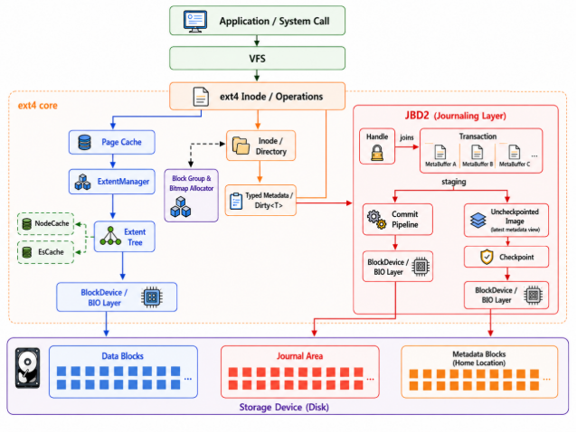


代码位于 `kernel/src/fs/fs_impls/ext4/`。`fs.rs` 管理挂载后的 EXT4 对象、同步和事务入口；`impl_for_vfs/` 提供 VFS 适配；`inode/` 负责文件、目录、截断和同步；`inode/extent_manager/` 维护 ExtentTree 与缓存；`journal/` 实现 JBD2 的提交、检查点、revoke 与恢复；`super_block.rs`、`block_group.rs`、`feature.rs` 与 `checksum.rs` 负责盘面解析、分配和格式校验。

### 3.2 VFS 接入与 EXT4 盘面对象

挂载阶段，系统读取 superblock、特性位、块大小和块组描述符，并建立块设备与 journal 的运行时对象。随后 `Ext4FileSystem`、`Ext4Inode` 与文件操作实现将 Asterinas VFS 的路径解析、创建、查找、读写、重命名、截断、同步和统计请求映射为 EXT4 的 inode、目录项、位图与 Extent 更新。

盘面层覆盖 superblock、block group、inode、目录项、块与 inode 位图、Extent、journal 等对象。所有会修改 inode、位图、目录项或 ExtentTree 的操作都要进入 journal 事务；数据页的传输则按 Buffered I/O、mmap 或 O_DIRECT 路径执行。这样既保留标准 EXT4 格式可被 Linux 工具识别的能力，也将内核 VFS 语义和块设备持久化连接起来。

### 3.3 ExtentManager 与空间管理

三条文件访问路径最终都通过 ExtentManager 取得逻辑块到物理块的映射。它负责查找、插入、删除、分裂和合并 Extent，并协调块分配、缓存更新与 journal 元数据修改。对空洞写入或预分配，系统先分配 unwritten Extent；数据 BIO 成功完成后，再在对应事务中将其转换为 written，避免崩溃后把其他文件释放块中的旧内容暴露给应用。

ExtentTree 是权威映射来源。EsCache 只缓存已经证实的区间状态：`AllWritten` 表示区间被 written Extent 完整覆盖，`AllMapped` 表示存在完整映射但可能含 unwritten 区间，`Unknown` 则要求重新遍历 ExtentTree。NodeCache 缓存热点外部节点，减少树遍历的块读，但不作为映射真值。该划分保证缓存失效最多退化为慢路径，而不会把不确定映射当成正确结果。

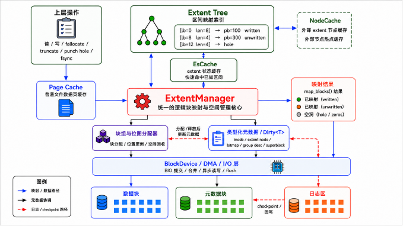


### 3.4 Buffered I/O、mmap 与 PageCache

普通 `read`/`write` 走 VFS、PageCache、ExtentManager 与 BIO。Buffered read 对空洞和 unwritten Extent 返回零；Buffered write 对已有稳定映射可直接更新缓存页并标记为 dirty。若写入引起文件扩展、空洞填充或块分配，系统先在事务内完成 Extent 与 inode 元数据更新，再将数据写入 PageCache。连续写回区间可合并为批量 BIO，减少逐页映射查询和设备提交开销。

mmap 通过 VMO 与同一套 PageCache 基础设施共享页面，因此 mmap 写、普通写、读取和 `fsync` 需看到一致的文件内容。`fsync`/`fdatasync` 推进与本次文件变化有关的 journal 事务：创建 inode、目录项、写入、truncate 或 Extent 变化均需要等待对应事务；纯属性变化由 `fsync` 覆盖而不强制 `fdatasync` 等待。同步完成后只清除脏状态，按一致性边界失效必要页面，而不是清空整个文件缓存，避免高频同步负载反复从设备读取仍有效的 clean 页。

### 3.5 O_DIRECT 与缓存一致性协议

O_DIRECT 根据 Extent 映射直接构造 IoBatch/BIO，不传输 PageCache 中的数据，但“绕过缓存”不意味着可以忽略缓存状态。所有 O_DIRECT 请求先校验文件偏移和长度的文件系统块对齐，不满足时返回 `EINVAL`；随后在 inode 写锁保护的顺序下完成缓存协调、映射更新和数据 I/O。

对于 direct read，若重叠范围仍有脏页，先执行 `flush_range` 将脏页写回，再从块设备读取，避免 direct read 得到落后于缓存的新数据。对于 direct write，先写回重叠脏页，再通过 `invalidate_range` 逐页排空并失效重叠缓存页，防止后续 Buffered read 继续读取旧副本。空洞 direct write 先分配 unwritten Extent，连续物理区间合并为 IoBatch，待全部数据 BIO 成功后才将相应区间转为 written 并记录 inode after-image；事务提交前的 barrier 由此形成 O_DIRECT 下的 ordered-data 约束。


### 3.6 JBD2 事务、提交与检查点

每个元数据操作经 `Ext4::begin_op(credits)` 申请 credits 并取得 `OpHandle`，再纳入当前 `Transaction`。credits 是本次操作可能修改的元数据块数的保守预留；预留不足、日志空间不可恢复或设备 I/O 失败时，文件系统会中止 journal 并拒绝后续写操作，而非带着静默丢失元数据的状态继续运行。文件创建、Extent 分配、位图修改和 inode 更新等跨块变更因此拥有共同事务边界。

JBD2 事务经历 Running、Commit、Checkpoint 与 Recovery 四个阶段。Running 阶段由 Handle 在 credits 范围内捕获元数据 after-image，并登记 ordered 数据写回；Commit 阶段由 group commit 汇集运行事务，依次写入 descriptor、metadata payload、revoke 记录和带校验和的 commit block；Checkpoint 阶段以 lazy checkpoint 的方式按事务顺序将已提交元数据写回 home blocks，淘汰已不再需要的 after-image 并释放日志空间。

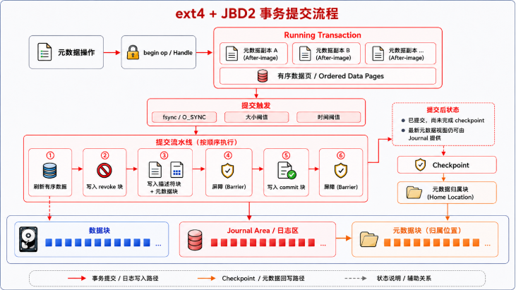

| 日志记录 | 作用 | 恢复语义 |
| --- | --- | --- |
| Descriptor | 记录 transaction 序号与一个或多个目标 home block tag | 指定后续 payload 的归属，不代表事务提交 |
| Metadata payload | 保存 inode、位图、块组描述符、目录项或 Extent 节点的 after-image | 仅在同事务存在有效 commit block 时进入重放候选 |
| Revoke | 标识被释放或复用的元数据块及其事务序号 | `PASS_REVOKE` 收集后，抑制较旧事务对该块的重放 |
| Commit block | 记录 transaction 序号、提交时间和校验和 | 校验通过才建立提交边界，不完整事务被忽略 |
| Journal superblock | 保存环形日志起点、序号和特性信息 | 定位扫描窗口，checkpoint 推进后更新可回收起点 |

#### 去 Buffer Head 的元数据管理

实现不沿用 Linux EXT4 的 `buffer_head` 链表作为元数据写入的中间层，而是以 typed metadata/dirty 对象保存 inode、Extent、位图、组描述符和 superblock 的修改，并以 transaction mirror/meta buffer 捕获 after-image。该设计仍保持 JBD2 的锁、事务边界和提交语义，但使元数据对象能够直接进入提交管线与 checkpoint，适配 Asterinas 的 Rust 内存管理模型。

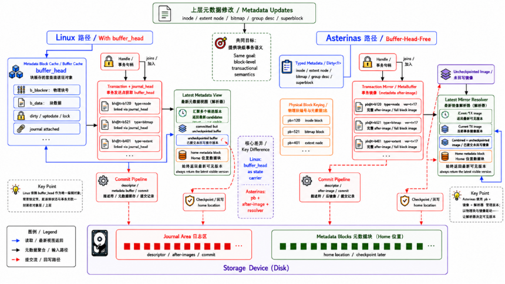

### 3.7 挂载恢复、并发与外部电源保护

系统采用 JBD2 ordered 模式：关联数据先完成写回，再写入日志记录；只有 commit block 经 barrier 持久化后，事务才获得可恢复资格。挂载恢复严格执行 `PASS_SCAN`、`PASS_REVOKE` 和 `PASS_REPLAY`：先识别完整提交事务，再收集 revoke 集合，最后只重放未被 revoke 覆盖的 after-image。日志校验和不匹配、journal 结构无效、空间预留错误或设备 I/O 失败时，系统进入 abort/只读降级路径，不继续接受可能破坏盘面的新写操作。

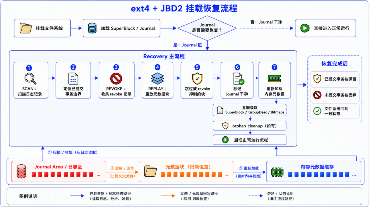

运行时锁分别保护 inode 状态、目录命名空间、ExtentTree、block group 和 journal state。多 inode 操作按 inode 号固定顺序加锁，Journal state 作为叶锁最后获取；EsCache 和 NodeCache 的临界区不跨设备 I/O 或日志调用。这样避免 rename、link 等跨 inode 操作形成 ABBA 死锁，也避免提交与前台 I/O 相互等待。

外部电源保护模式面向可靠 UPS 或备用电源场景：运行期间优先完成文件数据写回，日志和部分元数据保留在内存；收到掉电通知后关闭操作入口、停止提交线程、回滚不完整事务，并在备用电源窗口内统一写回可信的数据和元数据。该模式默认关闭，只有掉电通知可靠送达、备用供电足以完成回滚和写回时才能启用。

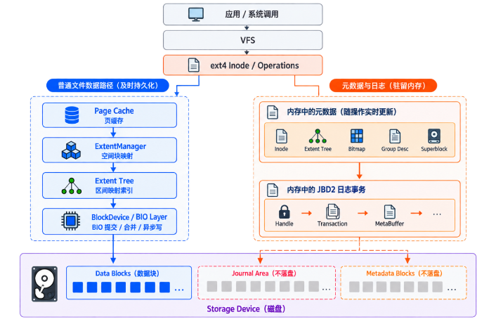


## 四、测试与评估

### 4.1 测试环境与验证策略

| 项目 | 配置 |
| --- | --- |
| 宿主系统 | Ubuntu 24.04.1，Linux 6.8.0-41 |
| 虚拟化环境 | QEMU/KVM，virtio-blk 块设备 |
| 容器镜像 | `asterinas/asterinas:0.17.0-20260227` |
| 虚拟机配置 | 8 GiB 内存，单处理器 |
| 对照系统 | 相同虚拟化与块设备环境下的 Linux EXT4 |
| 测试类型 | xfstests、并发正确性、崩溃一致性、Linux 互操作、fio |

项目建立“接口行为、运行时一致性、崩溃恢复、独立 oracle、Linux 互操作”的验证链。xfstests 检查用户可见的 POSIX/EXT4 语义；并发与缓存测试检查不同 I/O 路径的可见性；崩溃矩阵枚举每个工作负载的持久化前缀；oracle、accounting、checksum 和 walcheck 分别独立验证数据、空间记账、元数据校验和与日志写序；Linux 双向互操作检查磁盘格式没有形成只能由本实现读取的私有状态。

### 4.2 xfstests 功能与兼容性评估

本次 xfstests 共 81 项：**78 项 PASS、2 项稳定 FAIL、1 项 FLAKY**，通过率为 **96.3%**。78 个通过用例按主要功能只计入一个类别。

| 测试类别 | 通过数量 | 代表用例 | 覆盖能力 |
| --- | --- | --- |
| 文件与目录命名空间、链接、权限和元数据 | 27 PASS | `generic/002`、`generic/035`、`generic/401` | create/unlink、rename、硬/符号链接、目录压力、权限、时间戳、`mknod`、`statx` 与 Unicode 文件名 |
| 常规读写、截断、追加与数据完整性 | 15 PASS | `generic/001`、`generic/014`、`generic/639` | 随机读写校验、fsstress、truncate、洞文件、`O_APPEND`、向量 I/O、splice、高偏移 I/O、orphan 和卸载重挂 |
| Extent、预分配、`fallocate` 与 ENOSPC | 12 PASS | `generic/102`、`generic/213`、`generic/619` | unwritten Extent、预分配、对齐、空间预约、满盘重试、并发 ENOSPC 与块分配一致性 |
| O_DIRECT 与 buffered/direct 一致性 | 10 PASS | `generic/130`、`generic/133`、`generic/214`、`generic/609` | 向量直接读写、同文件并发 I/O、unwritten Extent 直接写、大请求分段、混合访问、PageCache 失效与 `O_DSYNC` |
| mmap、页缓存一致性与虚拟内存竞争 | 13 PASS | `generic/030`、`generic/346`、`generic/638` | 映射写、remap/truncate、mmap 与 `pwrite` 竞争、零填充、stale mmap read 与多页重叠复制 |
| EXT4 挂载统计语义 | 1 PASS | `ext4/042` | `statfs` 的 df/overhead 输出以及相关挂载选项行为 |

稳定失败的 `generic/127` 和 `generic/452` 集中在 mmap 实现边界；`generic/371` 在并发写与 `fallocate` 的 ENOSPC 竞争中表现为 FLAKY，统计中如实保留。

### 4.3 并发与缓存一致性验证

并发测试使用确定性数据模式驱动多个 worker 读写，结束后校验每个文件的长度和内容 hash；xfstests 的 fsstress 与并发用例补充命名空间和空间操作。缓存一致性测试交叉组合 Buffered I/O、O_DIRECT、mmap、truncate 与 `fallocate`，重点确认路径切换后不会读到旧副本。

| 测试族 | 检查内容 | 判定方式 |
| --- | --- | --- |
| 多 worker 文件写入 | 是否出现错写、漏写或文件大小错误 | 结束后逐文件核对确定性 hash 和长度 |
| Buffered 写后直接读 | direct read 能否观察到 PageCache 中尚未写回的新内容 | 对重叠范围先写回，再逐字节比较 |
| 直接写后 Buffered 读 | 缓存是否保留 direct write 之前的旧副本 | direct write 完成后从普通 `read` 路径读回比较 |
| mmap 基本路径 | 映射页修改与 `read`、`write`、`fsync` 间的可见性 | 对照读取内容和同步结果 |
| namespace 与空间压力 | `rename`、`unlink`、truncate、`fallocate`、ENOSPC 的并发组合 | xfstests、fsstress、无 panic 与盘后检查 |

### 4.4 崩溃矩阵、oracle 与格式验证

崩溃矩阵记录单个工作负载产生的块设备写入及 FLUSH 边界，在每个可观察持久化前缀构造掉电镜像。每张镜像均独立重新挂载、执行 JBD2 recovery，再经过严格 `e2fsck`、数据 oracle、accounting、checksum、walcheck 检查，最后汇总为 green/red。该方法覆盖 descriptor、metadata payload、commit block、checkpoint 以及 journal 回绕之间的写序关系。

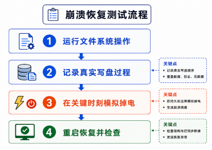


| 验证项 | 覆盖与检查内容 | 结果 |
| --- | --- | --- |
| 标准日志矩阵 | 232 个工作负载的常规提交、恢复、revoke 与 checkpoint 组合 | 931 个崩溃点，0 red |
| 4 MiB 小日志矩阵 | journal wrap、空间背压、频繁 checkpoint 与多事务状态 | 1629 个崩溃点，0 red |
| 数据持久化 oracle | `fsync`/`fdatasync` 承诺的数据在任意掉电前缀后是否完整存在 | 232 个工作负载生效，308 条断言全部通过 |
| strict `e2fsck`、accounting、checksum | 目录、inode、Extent、位图、记账和校验和 | 标准与小日志矩阵均通过 |
| walcheck | home block 元数据写入是否具有已提交事务 after-image 来源 | 2360 项匹配，无 violation |

Linux 互操作从两个方向验证：Linux 创建或更新的标准 EXT4 镜像由 Asterinas 挂载、读取并继续修改；Asterinas 创建或修改、卸载后的镜像由 Linux 重新挂载、逐项读取并用 `e2fsck` 检查。测试同时核对 `metadata_csum`、journal checksum v2/v3、64-bit journal tag、descriptor 和 commit record。

### 4.5 性能评估方法与结果

性能测试在与 Linux EXT4 相同的 QEMU/KVM + virtio-blk 环境下进行，以平均吞吐（MB/s）和总耗时（s）为指标。顺序 O_DIRECT fio 测试覆盖 4 KiB、16 KiB、64 KiB、256 KiB 和 1 MiB 五种块大小；同文件并发写比较 `numjobs=2/4`；外部电源保护模式使用每次写入后执行 `fsync` 的顺序写负载，以放大日志同步路径的差异。相关测试脚本组织在 `test/initramfs/src/benchmark/`。

| 场景 | Asterinas EXT4 | Linux EXT4 / 基线 | 相对结果 |
| --- | ---: | ---: | --- |
| 顺序写，4 KiB 至 1 MiB | 41、146、498、712、743 MB/s | 39、137、466、646、673 MB/s | 105.1%-110.4% |
| 顺序读，4 KiB 至 1 MiB | 44、161、618、1898、3750 MB/s | 40、144、552、1705、3308 MB/s | 110.0%-113.4% |
| 同文件并发写，`numjobs=2` | 1380 MB/s | 1340 MB/s | 103% |
| 同文件并发写，`numjobs=4` | 2446 MB/s | 2194 MB/s | 111% |

<p align="center">
  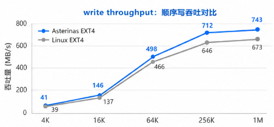
  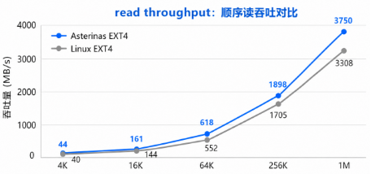
</p>

<p align="center">
  
  
</p>

五种块大小下，Asterinas EXT4 的读写平均吞吐均高于同环境 Linux EXT4 对照。随着块大小增大，两侧吞吐都持续提升；读路径为 Linux 的 110.0%-113.4%，写路径为 105.1%-110.4%。

<p align="center">
  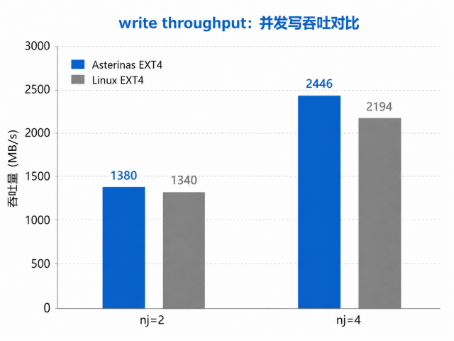
  
</p>

`numjobs=2` 时吞吐为 1380 MB/s，对照 Linux 为 1340 MB/s；`numjobs=4` 时分别为 2446 MB/s 与 2194 MB/s。这说明写回、映射和设备提交路径能够随并发度扩展，同时仍受上一节一致性验证约束。

外部电源保护模式与标准 JBD2 模式使用相同代码、QEMU/KVM 环境、EXT4 镜像参数和 `virtio-blk` 设备，仅切换 `EXT4_POWER_PROTECTED` 开关。每个用例以 `direct=1`、`numjobs=1`、`fsync=1` 进行顺序写；掉电通知后的冻结、回滚和批量写回不计入 fio 运行时间。

<p align="center">
  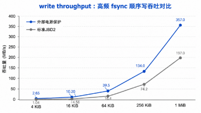
  
</p>

| 块大小 | 标准 JBD2 | 外部电源保护 | 相对性能 | 性能提升 |
| --- | ---: | ---: | ---: | ---: |
| 4 KiB | 1.04 MB/s | 2.65 MB/s | 254.81% | 154.81% |
| 16 KiB | 4.56 MB/s | 10.20 MB/s | 223.68% | 123.68% |
| 64 KiB | 16.4 MB/s | 39.5 MB/s | 240.85% | 140.85% |
| 256 KiB | 74.2 MB/s | 134.0 MB/s | 180.59% | 80.59% |
| 1 MiB | 197.0 MB/s | 357.0 MB/s | 181.22% | 81.22% |

## 五、性能优化与创新

### 5.1 统一 Extent 映射与缓存优化

ExtentManager 汇总三条 I/O 路径的逻辑块到物理块映射。项目通过缩短 Extent 结构修改和事务持有时间、缓存已确认的映射事实、减少重复树遍历，降低小粒度写入和频繁映射准备的开销。EsCache 以可证明的区间状态加速查询，NodeCache 则用于热点外部节点访问，两者都不替代 ExtentTree 的权威判断。

### 5.2 三路径一致性协议

Buffered I/O、mmap 和 O_DIRECT 的实现不是三套彼此独立的读写逻辑，而是在同一 Extent 映射基础上定义缓存写回、排空与失效顺序。该设计将性能路径和正确性边界放在同一协议内处理，使缓存命中、混合 I/O 和映射更新可被统一验证。

### 5.3 完整 JBD2 生命周期与可验证恢复

项目实现从 credits、Handle、Transaction 到 ordered commit、checkpoint、revoke 与 recovery 的完整日志生命周期。再以 FLUSH 点故障注入、严格 `e2fsck` 与数据 oracle 验证恢复结果，将日志设计从功能实现延伸到可重复的崩溃一致性证明。

### 5.4 面向可靠供电环境的持久化优化

外部电源保护模式区分“任意时刻可能突然掉电”和“可靠供电、可受控关机”两类部署条件。在后者中延后日志与部分元数据写回，减少高频 `fsync` 的重复持久化开销；该能力通过显式配置启用，默认 JBD2 语义保持不变。

## 六、运行与复现

常用的构建和兼容性测试入口如下。性能用例及其 `run.sh`、结果描述文件组织在 `test/initramfs/src/benchmark/` 下。

```bash
# 基础检查
make check

# 官方 xfstests 测试集
make run_kernel AUTO_TEST=conformance \
  CONFORMANCE_TEST_SUITE=xfstests \
  XFSTESTS_RUNLIST=/opt/xfstests/full.list \
  XFSTESTS_DISK_SIZE=12G MEM=8G RELEASE=1

# 进入测试目录查看 fio 用例及其运行脚本
cd test/initramfs/src/benchmark
```

不同设备上的绝对耗时与带宽可能存在差异；复现时应以 PASS/FAIL、崩溃恢复结果、同口径 Linux 对照趋势和脚本记录的配置为准。

## 七、项目目录

```text
.
├── kernel/
│   └── src/fs/fs_impls/ext4/             # 原生 EXT4 主实现
│       ├── fs.rs                         # 文件系统对象、挂载、同步与事务入口
│       ├── super_block.rs                # superblock 解析、挂载校验与磁盘几何信息
│       ├── block_group.rs                # block group、位图、inode 与块分配
│       ├── feature.rs / checksum.rs      # EXT4 特性门与 metadata checksum
│       ├── impl_for_vfs/                 # Asterinas VFS FileSystem / Inode / FileOps 适配
│       ├── inode/
│       │   ├── mod.rs                    # inode、读写、truncate、fallocate 与 fsync
│       │   ├── dir/                      # 目录项、目录哈希和 htree
│       │   └── extent_manager/           # ExtentTree、EsCache、NodeCache 与映射路径
│       └── journal/                      # JBD2 transaction、commit、checkpoint、revoke、recovery
├── test/
│   └── initramfs/
│       ├── src/conformance/xfstests/     # xfstests 用例清单与 guest 运行脚本
│       ├── src/benchmark/                # fio 测试用例、run.sh 与结果描述
│       └── nix/                          # initramfs 测试与 benchmark 配置
├── docs/
│   ├── image/                            # README 使用的校徽、架构图与性能图表
│   └── AI_usage/                         # AI 使用说明与阶段记录
├── 决赛文档.pdf                           # 决赛完整设计、实现与测试文档
├── 决赛幻灯片.pptx                        # 决赛展示材料
└── Makefile                              # 构建、内核运行和自动化测试入口
```

## 八、AI 使用说明

本项目在开发过程中使用 AI 工具辅助信息整理、代码风险检查、运行问题排查、自动化测试脚本维护和测试数据汇总。参赛队成员负责需求拆分、技术方案选择、功能代码实现与修改、测试取舍、结果验收和最终提交；AI 不替代参赛队对代码正确性、实验结果和竞赛材料真实性的责任。

| 项目 | 说明 |
| --- | --- |
| 交互与执行工具 | Claude Code（命令行交互与执行 harness） |
| 使用的大模型 | DeepSeek V4 Pro |
| 使用周期 | 2026 年 7 月至 2026 年 8 月 |
| 主要用途 | 实现思路讨论、代码风险检查、panic/timeout 日志分析、测试脚本辅助、重复测试执行和数据整理 |
| 人工责任 | 代码实现、关键修改决策、测试设计、结果复核、文档与最终提交均由队伍成员负责 |

完整 AI 使用说明与阶段记录将维护在 `docs/aiuse/` 目录。

## 九、参考资料

- [Asterinas](https://github.com/asterinas/asterinas)：本项目运行的 Rust framekernel 操作系统。
- [Linux EXT4 文档](https://docs.kernel.org/admin-guide/ext4.html)：EXT4 设计与接口语义参考。
- [Linux VFS 文档](https://docs.kernel.org/filesystems/vfs.html)：Linux VFS 架构参考。
- [xfstests](https://git.kernel.org/pub/scm/fs/xfs/xfstests-dev.git)：文件系统回归测试框架。
- [yuoo655/ext4_rs](https://github.com/yuoo655/ext4_rs)：Rust EXT4 盘面结构与基础实现参考。
