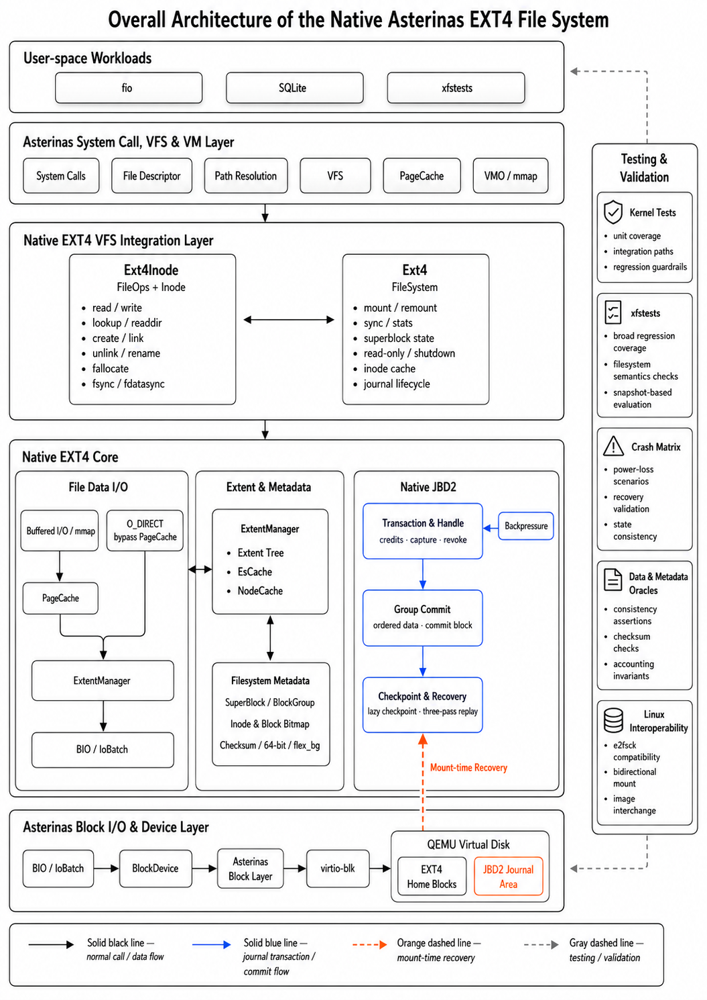
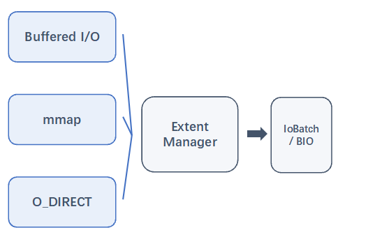
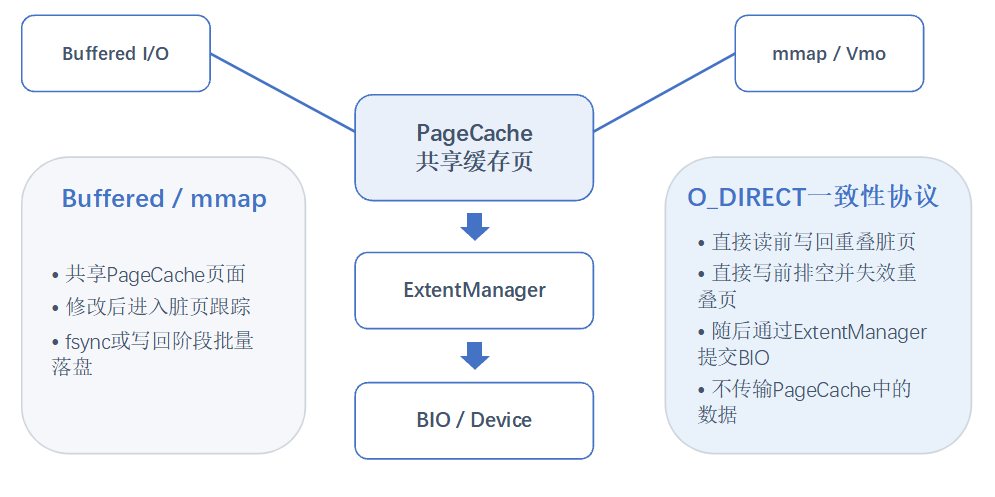
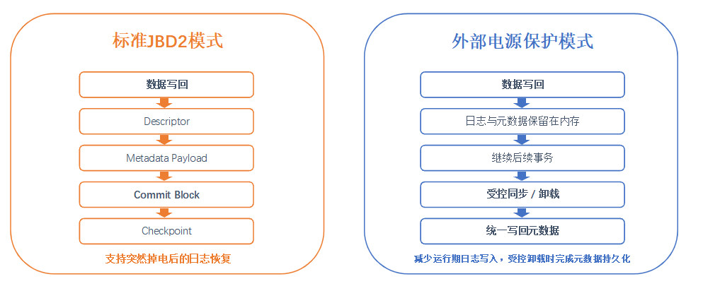
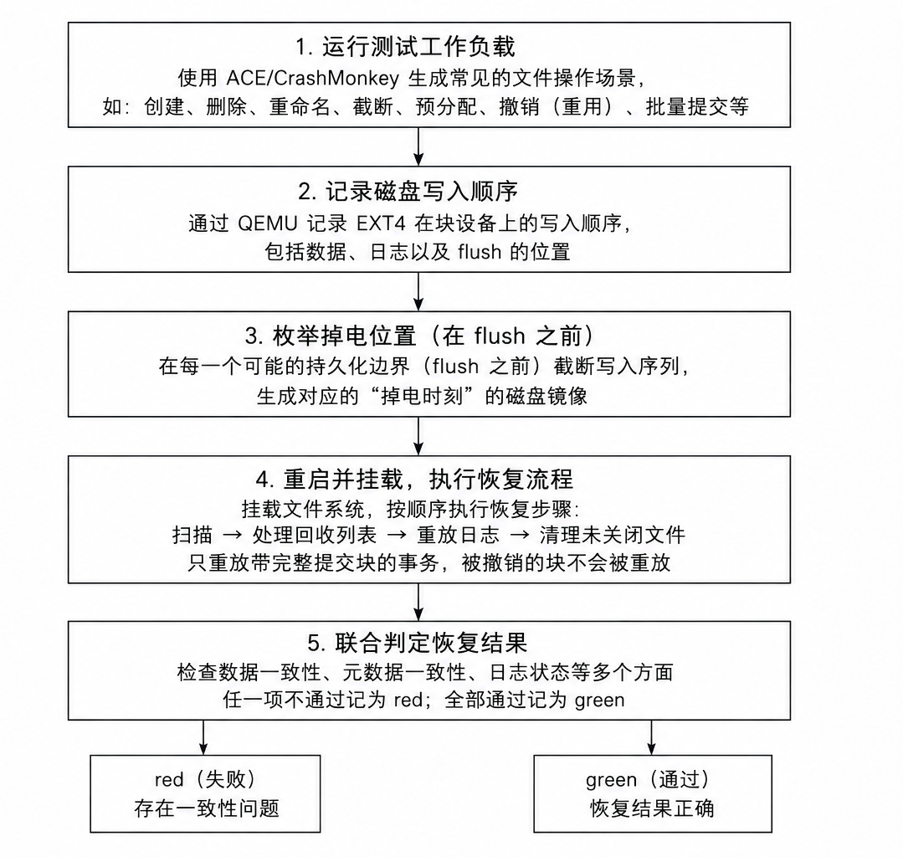
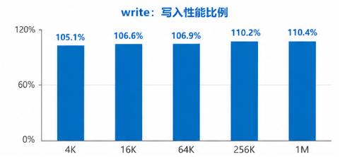
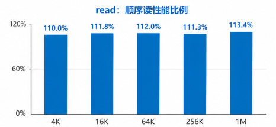
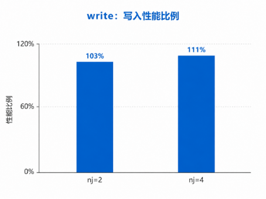
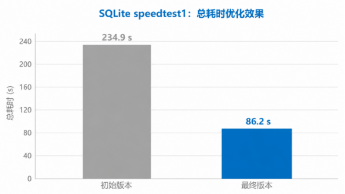
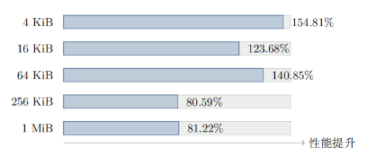

<p align="center">
  
</p>

# Asterinas EXT4 - 面向 RustOS 的高性能强一致性 EXT4 文件系统

> 2026 年全国大学生计算机系统能力大赛操作系统设计赛
>
> 赛题方向：面向 RustOS 的高性能强一致性文件系统研究

## 项目目录

- [一、基本信息](#一基本信息)
- [二、项目背景与目标](#二项目背景与目标)
- [三、系统设计与实现](#三系统设计与实现)
- [四、测试与评估](#四测试与评估)
- [五、性能优化与创新](#五性能优化与创新)
- [六、运行与复现](#六运行与复现)
- [七、项目目录](#七项目目录)
- [八、AI 使用说明](#八ai-使用说明)
- [九、参考资料](#九参考资料)

## 一、基本信息

### 1.1 项目信息

| 项目 | 内容 |
| --- | --- |
| 项目名称 | 面向 RustOS 的高性能强一致性 EXT4 文件系统 |
| 运行平台 | Asterinas Rust framekernel 操作系统 |
| 队伍名称 | 日志写了吗 |
| 所属高校 | 哈尔滨工业大学（深圳） |
| 队伍成员 | 俞杰、梁丙煜、王毅航 |
| 校内导师 | 夏文、李诗逸 |
| 主要语言 | Rust |

### 1.2 项目摘要

本项目在 Asterinas Rust framekernel 操作系统中实现原生 EXT4 文件系统，使 RustOS 能够直接使用标准 EXT4 磁盘格式承载真实 Linux 应用负载。系统完成 POSIX 核心文件语义、目录操作、inode 与块分配、Extent 映射、PageCache、Buffered I/O、mmap、O_DIRECT、`fsync`/`fdatasync`，以及 JBD2 ordered 日志、检查点和崩溃恢复等主路径。

项目关注的不只是“能够读写文件”，而是同时保障三类一致性：元数据在崩溃后的可恢复性，Buffered I/O、mmap 与 O_DIRECT 之间的数据可见性，以及多线程读写时的运行时安全性。在此基础上，项目优化 Extent 映射、缓存、批量 I/O、事务持有时间与高频 `fsync` 路径，并通过 xfstests、崩溃矩阵、数据 oracle、Linux 双向互操作、fio 和 SQLite speedtest1 建立验证闭环。

### 1.3 已实现功能

- **标准 EXT4 盘面与 VFS 接入**：支持 superblock、block group、inode、目录项、位图、Extent 等关键盘面结构，并完成 Asterinas VFS 适配。
- **POSIX 文件系统语义**：覆盖创建、读写、截断、目录操作、链接、权限、时间戳、`fallocate`、`statfs`、`fsync`/`fdatasync` 等主路径。
- **多 I/O 路径**：打通 Buffered I/O、PageCache、mmap 和 O_DIRECT，统一由 ExtentManager 管理逻辑块到物理块的映射。
- **JBD2 日志与恢复**：实现 credits、Handle、Transaction、ordered data、descriptor、commit、checkpoint、revoke 与三阶段恢复流程。
- **正确性验证**：完成 xfstests 分类回归、崩溃一致性、数据 oracle、并发压力与 Linux EXT4 镜像双向互操作验证。

### 1.4 关键结果

| 方向 | 当前结果 | 验证依据 |
| --- | --- | --- |
| EXT4 与 POSIX 主路径 | 已完成 | xfstests 覆盖命名空间、常规读写、Extent、O_DIRECT 与 mmap 等主路径 |
| JBD2 日志与恢复 | 已完成 | 标准 journal 931 点、4 MiB 小 journal 1629 点崩溃矩阵均为 0 red |
| 多路径缓存一致性 | 已完成 | direct/buffered 混合 I/O、PageCache、mmap 与 O_DIRECT 专项验证 |
| 并发正确性 | 已完成重点验证 | fsstress、同文件 direct/buffered 竞争、死锁压力和状态观察均 PASS |
| Linux 互操作 | 已完成 | Linux 创建的镜像可由 Asterinas 读写；Asterinas 修改后的镜像可由 Linux 挂载并检查 |
| 性能结果 | 已形成结果 | fio 顺序 I/O 达到 Linux EXT4 的 105.1%-113.4%，SQLite speedtest1 优化至 86.2 s |

### 1.5 分工说明

| 成员 | 主要工作 |
| --- | --- |
| 俞杰 | EXT4/JBD2 核心设计、崩溃一致性验证、比赛材料整理 |
| 梁丙煜 | Asterinas VFS、PageCache/mmap/O_DIRECT 路径接入与性能优化 |
| 王毅航 | xfstests 适配、并发测试、fio/SQLite 测试脚本与结果分析 |

### 1.6 文档索引

- [benchmark](test/bench/README.md)：性能测试脚本、结果口径与复现说明。
- `docs/image/`：README 使用的架构图、测试流程与性能图表。
- `docs/aiuse/`：AI 使用说明与各阶段使用记录，后续由参赛队补充维护。

## 二、项目背景与目标

### 2.1 项目背景

文件系统是数据库日志、AI 训练 checkpoint、对象存储元数据等负载最终落到持久化设备的关键层。它既要提供 POSIX 文件、目录、权限与同步语义，也要负责块分配、空间回收和磁盘布局，并在系统异常或掉电后恢复到可检查的一致状态。

EXT4 是 Linux 中应用广泛的通用文件系统。将其原生实现引入 Asterinas，一方面补齐 RustOS 的本地持久化能力，另一方面可直接复用标准 EXT4 磁盘格式、Linux 工具链与既有应用生态。项目以 Rust 的内存安全优势为基础，在性能、并发和崩溃一致性之间建立明确的实现边界。

### 2.2 项目目标

1. 在 Asterinas 上实现标准 EXT4 磁盘格式和 POSIX 核心文件系统接口。
2. 实现 JBD2 ordered 日志语义，使元数据更新具备提交、检查点和崩溃恢复能力。
3. 打通 PageCache、Buffered I/O、mmap、O_DIRECT、`fsync`/`fdatasync` 与块设备 I/O 路径。
4. 通过 xfstests、崩溃恢复、数据 oracle、Linux 互操作和并发测试验证正确性。
5. 在统一 QEMU/KVM + virtio-blk 环境中对照 Linux EXT4，评估 fio 与 SQLite 真实负载性能。

### 2.3 核心挑战

| 挑战 | 说明 |
| --- | --- |
| EXT4 盘面结构 | superblock、block group、inode、目录项、Extent 与位图必须保持相互一致。 |
| 崩溃一致性 | 日志、写入顺序、flush、checkpoint 与 recovery 共同决定崩溃后能否恢复。 |
| 多路径缓存协同 | Buffered I/O、mmap 和 O_DIRECT 的传输方式不同，但必须共享一致的文件映射和可见性语义。 |
| 并发与锁序 | namespace、多 inode、Extent、Journal 和缓存对象需要稳定锁序，避免死锁与状态错乱。 |
| 性能与语义平衡 | journal、`fsync`、缓存失效和结构锁保障正确性，也会增加高性能设备上的软件路径开销。 |

## 三、系统设计与实现

### 3.1 总体架构

系统以 VFS 为上层接口，以统一 Extent 映射和 JBD2 事务为核心，将用户态负载连接到 virtio-blk 块设备。Buffered I/O、mmap 与 O_DIRECT 共享映射语义；JBD2 负责元数据更新的持久化顺序和挂载恢复；测试与验证体系从内核路径外侧形成闭环。



代码位于 `kernel/src/fs/fs_impls/ext4/`。`fs.rs` 管理 EXT4 运行时对象和事务入口，`impl_for_vfs/` 提供 VFS 适配，`inode/extent_manager/` 维护 Extent 映射，`journal/` 实现提交、检查点、revoke 与恢复。

### 3.2 文件读写与 Extent 管理

三条文件访问路径汇合到 ExtentManager：Buffered I/O 修改 PageCache 页并标记脏页，mmap 通过 VMO 使用共享缓存页，O_DIRECT 绕过 PageCache 的数据传输但仍使用同一套 Extent 映射。ExtentManager 统一负责查找、插入、删除、分裂与合并 Extent，并为空间分配、缓存更新和 journal 事务提供一致的边界。

对于写洞和预分配，系统先使用 unwritten Extent 表示已分配但尚未完成数据写入的区间。只有数据 I/O 成功后才将其转换为 written，避免崩溃时暴露其他文件残留的数据。



### 3.3 PageCache、mmap 与 O_DIRECT 一致性

PageCache 支撑 Buffered I/O 与 mmap。O_DIRECT 虽不传输 PageCache 中的数据，但必须维护缓存边界：直接读前写回重叠脏页，直接写前排空并失效重叠页，随后才经 ExtentManager 构造 IoBatch 和 BIO。该协议保证不同路径不会读到旧数据，也不会绕过必要的映射更新。

映射缓存中，EsCache 只保存已确认的映射事实，以 `AllWritten`、`AllMapped` 与 `Unknown` 表示区间覆盖状态；当状态为 `Unknown` 时，系统重新遍历权威的 ExtentTree。NodeCache 缓存热点外部 Extent 节点，但不替代真实映射判断。缓存失效时退回慢路径，而不会改变文件系统语义。



### 3.4 JBD2 事务与崩溃恢复

所有元数据修改经 `Ext4::begin_op(credits)` 申请 journal credits 并取得 `OpHandle`，再纳入 `Transaction` 统一管理。文件创建、Extent 分配、位图更新和 inode 修改等跨块变更在同一事务边界内完成，避免只落盘部分元数据而遗留不一致盘面。

系统采用 JBD2 ordered 模式：关联数据先写回，再按 descriptor、metadata payload 和 commit block 的顺序完成日志提交；仅已持久化 commit block 的事务具备恢复资格。挂载恢复执行 `PASS_SCAN`、`PASS_REVOKE` 与 `PASS_REPLAY`，只重放有效且未被 revoke 取消的元数据版本。checkpoint 将已提交事务逐步写回 home blocks，以回收 journal 空间。

### 3.5 并发控制

运行时对象锁保护 inode 状态、目录命名空间、ExtentTree 和 block group；JBD2 事务保证提交和恢复顺序。多 inode 操作按 inode 号稳定加锁，Journal state 作为叶锁最后获取，避免形成 ABBA 死锁。EsCache 与 NodeCache 的临界区不跨设备 I/O 或日志操作。

同文件 O_DIRECT 写仍保留保护结构变化的 inode 写锁，同时通过减少锁内重复映射查询、限制分块大小、连续 BIO 提交和缩短事务持有时间改善并发写效率。映射状态仅在数据 I/O 成功后提交，保持 unwritten Extent 转换的正确顺序。

### 3.6 外部电源保护模式

标准模式遵循 JBD2 持久化语义，支持突然掉电后的日志恢复。面向 UPS、机架级电池等可靠供电场景，项目设计可选外部电源保护模式：运行期间优先完成文件数据写回，日志和部分元数据保留在内存，在受控同步或卸载时统一持久化，从而降低高频 `fsync` 的重复 I/O 开销。

该模式默认关闭，只有在可靠供电且可保证受控同步、卸载时才能启用；默认模式的突然掉电恢复语义不受影响。



## 四、测试与评估

### 4.1 测试环境

| 项目 | 配置 |
| --- | --- |
| 宿主系统 | Ubuntu 24.04.1，Linux 6.8.0-41 |
| 虚拟化环境 | QEMU/KVM，virtio-blk 块设备 |
| 容器镜像 | `asterinas/asterinas:0.17.0-20260227` |
| 虚拟机配置 | 8 GiB 内存，单处理器 |
| 对照系统 | 相同虚拟化与块设备环境下的 Linux EXT4 |
| 测试类型 | xfstests、并发正确性、崩溃一致性、Linux 互操作、fio、SQLite speedtest1 |

### 4.2 功能与兼容性测试

xfstests 按能力域覆盖 EXT4 主路径，当前汇总为 **78 PASS、2 FAIL、1 FLAKY**，通过率为 **96.3%**。

| 测试类别 | 通过数量 | 覆盖能力 |
| --- | --- | --- |
| 文件与目录命名空间 | 24 PASS | create、open、read、write、mkdir、rmdir、rename、unlink、权限、atime、ENOSPC 等主路径 |
| 并发与压力测试 | 10 PASS | 多进程 fsstress、并发文件操作、路径压力、近满盘压力与恢复场景 |
| PageCache / O_DIRECT / mmap 一致性 | 9 PASS | buffered I/O、direct I/O、mmap 写入、truncate 后页缓存失效及混合读写 |
| JBD2 日志恢复 | 6 PASS | 日志提交、replay、元数据恢复和 EXT4 日志相关场景 |
| `fsync` / `fdatasync` 持久化语义 | 11 PASS | 文件大小与数据持久化、元数据边界、shutdown 后日志恢复等 |
| 其他 EXT4 主路径 | 18 PASS | Extent、预分配、链接、时间戳和挂载后检查等补充场景 |

### 4.3 崩溃一致性与数据 oracle

崩溃测试在 JBD2 descriptor、metadata payload、commit block 与 checkpoint 等关键位置逐个注入断电，随后重启同一 EXT4 镜像，执行 JBD2 recovery、严格 `e2fsck` 与 oracle 检查。流程同时覆盖常规提交、日志空间紧张和频繁 checkpoint 等压力场景。

| 验证项 | 结果 |
| --- | --- |
| 标准 journal 崩溃矩阵 | 931 个崩溃点，0 red |
| 4 MiB 小 journal 崩溃矩阵 | 1629 个崩溃点，0 red |
| 崩溃矩阵合计 | 2560 个崩溃点，0 red |
| WAL 检查 | 2360 个 home block after-image 匹配，无 violation |
| 盘面检查 | accounting、checksum、严格 `e2fsck` 均通过 |



### 4.4 并发正确性与 Linux 互操作

并发测试覆盖四进程 fsstress 下的 rename、unlink、mkdir、rmdir 等命名空间操作，同文件 direct writer / buffered reader 竞争，同文件 direct、sync、async I/O 死锁压力，以及持续覆盖写期间的元数据状态观察，重点场景均 PASS。

Linux 创建的 EXT4 镜像可由 Asterinas 挂载、读写并继续执行文件系统操作；Asterinas 修改后的镜像也可由 Linux 挂载并通过一致性检查。该验证覆盖 `metadata_csum`、journal checksum v2/v3、64-bit journal tag、descriptor 与 commit record 等标准盘面语义。

### 4.5 性能评估

性能测试在与 Linux EXT4 相同的 QEMU/KVM + virtio-blk 环境进行，以 I/O 总带宽和运行耗时为指标。详细脚本、原始记录与结果口径见 [benchmark](test/bench/README.md)。

| 场景 | 结果 |
| --- | --- |
| fio 顺序写 | 达到 Linux EXT4 的 105.1%-110.4% |
| fio 顺序读 | 达到 Linux EXT4 的 110.0%-113.4% |
| 同文件并发写，`numjobs=2` | 1380 MB/s，约为 Linux EXT4 的 103% |
| 同文件并发写，`numjobs=4` | 2446 MB/s，约为 Linux EXT4 的 111% |
| SQLite speedtest1 | 从 234.9 s 优化至 86.2 s，整体提升 2.73 倍 |
| 外部电源保护模式下的高频 `fsync` 写 | 相比标准 JBD2 提升 80.59%-154.81% |

<p align="center">
  
  
</p>

<p align="center">
  
  
</p>



## 五、性能优化与创新

### 5.1 统一 Extent 映射与缓存优化

ExtentManager 汇总三条 I/O 路径的逻辑块到物理块映射。项目通过缩短 Extent 结构修改和事务持有时间、缓存已确认的映射事实、减少重复树遍历，降低小粒度写入和频繁映射准备的开销。EsCache 以可证明的区间状态加速查询，NodeCache 则用于热点外部节点访问，两者都不替代 ExtentTree 的权威判断。

### 5.2 三路径一致性协议

Buffered I/O、mmap 和 O_DIRECT 的实现不是三套彼此独立的读写逻辑，而是在同一 Extent 映射基础上定义缓存写回、排空与失效顺序。该设计将“性能路径”和“正确性边界”放在同一协议内处理，使缓存命中、混合 I/O 和映射更新可被统一验证。

### 5.3 JBD2 完整生命周期与可验证恢复

项目实现从 credits、Handle、Transaction 到 ordered commit、checkpoint、revoke 与 recovery 的完整日志生命周期。再以 flush 点故障注入、严格 `e2fsck` 与数据 oracle 验证恢复结果，将日志设计从功能实现延伸到可重复的崩溃一致性证明。

### 5.4 面向可靠供电环境的持久化优化

外部电源保护模式区分“任意时刻可能突然掉电”和“可靠供电、可受控关机”两类部署条件。在后者中延后日志与部分元数据写回，减少高频 `fsync` 的重复持久化开销；该能力通过显式配置启用，默认 JBD2 语义保持不变。

## 六、运行与复现

常用入口如下。性能测试的完整环境、脚本与台账见 [benchmark](test/bench/README.md)。

```bash
# 基础检查
make check

# 官方 xfstests 测试集
make run_kernel AUTO_TEST=conformance \
  CONFORMANCE_TEST_SUITE=xfstests \
  XFSTESTS_RUNLIST=/opt/xfstests/full.list \
  XFSTESTS_DISK_SIZE=12G MEM=8G RELEASE=1

# JBD2 崩溃矩阵（<jlang-corpus-dir> 为已准备的工作负载目录）
bash test/crash/run_matrix.sh --keep <jlang-corpus-dir>

# 性能计分板跑批
bash test/bench/run_p9_sweep.sh
```

不同设备上的绝对耗时与带宽可能存在差异；复现时应以 PASS/FAIL、崩溃恢复结果、同口径 Linux 对照趋势和脚本记录的配置为准。

## 七、项目目录

```text
.
├── kernel/
│   └── src/fs/fs_impls/ext4/             # 原生 EXT4 主实现
│       ├── fs.rs                         # 文件系统对象、挂载、同步与事务入口
│       ├── super_block.rs                # superblock 解析、挂载校验与磁盘几何信息
│       ├── block_group.rs                # block group、位图、inode 与块分配
│       ├── feature.rs / checksum.rs      # EXT4 特性门与 metadata checksum
│       ├── impl_for_vfs/                 # Asterinas VFS FileSystem / Inode / FileOps 适配
│       ├── inode/
│       │   ├── mod.rs                    # inode、读写、truncate、fallocate 与 fsync
│       │   ├── dir/                      # 目录项、目录哈希和 htree
│       │   └── extent_manager/           # ExtentTree、EsCache、NodeCache 与映射路径
│       └── journal/                      # JBD2 transaction、commit、checkpoint、revoke、recovery
├── test/
│   ├── crash/                            # 崩溃矩阵、oracle、walcheck 与协议点测试
│   │   ├── run_matrix.sh                 # 崩溃矩阵入口
│   │   ├── oracle.py / walcheck.py       # 数据与 WAL 一致性判定
│   │   └── protocol/                     # JBD2 协议点和工作负载集合
│   ├── bench/                            # 性能跑批、结果台账与原始证据
│   │   ├── README.md                     # benchmark 使用与口径说明
│   │   ├── run_p9_sweep.sh               # 性能计分板入口
│   │   └── evidence/                     # fio、SQLite 等原始日志
│   └── initramfs/src/conformance/xfstests/
│       ├── full.list                     # xfstests 完整回归清单
│       ├── *.list                        # 分阶段与专项测试清单
│       └── run_xfstests.sh               # guest 内 xfstests 执行脚本
├── docs/
│   ├── image/                            # README 使用的校徽、架构图与性能图表
│   └── aiuse/                            # AI 使用说明与阶段记录（待补充）
└── Makefile                              # 构建、内核运行和自动化测试入口
```

## 八、AI 使用说明

本项目在开发过程中使用 AI 工具辅助信息整理、代码风险检查、运行问题排查、自动化测试脚本维护和测试数据汇总。参赛队成员负责需求拆分、技术方案选择、功能代码实现与修改、测试取舍、结果验收和最终提交；AI 不替代参赛队对代码正确性、实验结果和竞赛材料真实性的责任。

| 项目 | 说明 |
| --- | --- |
| 交互与执行工具 | Claude Code（命令行交互与执行 harness） |
| 使用的大模型 | DeepSeek V4 Pro |
| 使用周期 | 2026 年 7 月至 2026 年 8 月 |
| 主要用途 | 实现思路讨论、代码风险检查、panic/timeout 日志分析、测试脚本辅助、重复测试执行和数据整理 |
| 人工责任 | 代码实现、关键修改决策、测试设计、结果复核、文档与最终提交均由队伍成员负责 |

完整 AI 使用说明与阶段记录将维护在 `docs/aiuse/` 目录。提交前请补充每个阶段的工具、模型、用途、人工审查过程和对应记录，使 README 中的说明可以追溯。

## 九、参考资料

- [Asterinas](https://github.com/asterinas/asterinas)：本项目运行的 Rust framekernel 操作系统。
- [Linux EXT4 文档](https://docs.kernel.org/admin-guide/ext4.html)：EXT4 设计与接口语义参考。
- [Linux VFS 文档](https://docs.kernel.org/filesystems/vfs.html)：Linux VFS 架构参考。
- [xfstests](https://git.kernel.org/pub/scm/fs/xfs/xfstests-dev.git)：文件系统回归测试框架。
- [yuoo655/ext4_rs](https://github.com/yuoo655/ext4_rs)：Rust EXT4 盘面结构与基础实现参考。
