<div align="center">
  
</div>

# Asterinas EXT4 - 面向 RustOS 的高性能强一致性 EXT4 文件系统

> 2026 年全国大学生计算机系统能力大赛操作系统设计赛 OS 功能挑战赛道  
> 赛题方向：面向 RustOS 的高性能强一致性文件系统研究

## 项目目录

- [一、基本信息](#一基本信息)
- [二、项目背景与目标](#二项目背景与目标)
- [三、系统设计与实现](#三系统设计与实现)
- [四、测试与评估](#四测试与评估)
- [五、关键优化方法](#五关键优化方法)
- [六、运行与复现](#六运行与复现)
- [七、项目目录](#七项目目录)
- [八、已知限制与后续工作](#八已知限制与后续工作)
- [九、参考资料](#九参考资料)

## 一、基本信息

### 1.1 项目信息

| 项目 | 内容 |
| --- | --- |
| 赛题方向 | 2026 年全国大学生计算机系统能力大赛操作系统设计赛 OS 功能挑战赛道 |
| 项目名称 | 面向 RustOS 的高性能强一致性 EXT4 文件系统 |
| 运行平台 | Asterinas Rust framekernel 操作系统 |
| 队伍名称 | 日志写了吗队 |
| 所属高校 | 哈尔滨工业大学（深圳） |
| 队伍成员 | 俞杰、梁丙煜、王毅航 |
| 指导老师 | 夏文、李诗逸 |
| 主要语言 | Rust、C、Shell |
| 代码分支 | `feature-sqlite-phase-6` |
| 项目仓库 | [github.com/byliangg/os_com](https://github.com/byliangg/os_com/tree/feature-sqlite-phase-6) |
| 参考基础 | Asterinas、开源 EXT4 库 `ext4_rs` |

### 1.2 项目简介

本项目面向 Asterinas 缺少主流本地磁盘文件系统支持的问题，设计并实现了一个 EXT4 文件系统。系统支持 POSIX 核心文件接口、EXT4 Extent 连续块管理、JBD2 ordered 日志、PageCache、mmap、fsync/fdatasync、O_DIRECT 和多线程并发读写等关键路径。

在实现功能的基础上，项目重点关注两个问题。第一，文件系统在异常退出或主机崩溃后能否保持磁盘一致性；第二，在保留 EXT4/JBD2 一致性语义的前提下，能否在 RustOS 和 virtio-blk 环境中获得接近 Linux EXT4 的性能。围绕这两个问题，项目补齐了 JBD2 transaction、handle、commit、checkpoint、recovery、journal space 等模块，并通过 xfstests、Crash Matrix、fio、SQLite speedtest1 和自研并发 hash 校验进行验证。

当前版本已经完成 EXT4 主体功能和主要性能优化。合成 O_DIRECT 顺序读写已经接近或部分超过 Linux EXT4，同文件并发覆盖写在 numjobs=2/4 场景下超过 Linux EXT4；SQLite speedtest1 从初始版本的 2022s 优化到 234.9s，整体提升约 7.4 倍，并通过 `PRAGMA integrity_check` 校验。

### 1.3 项目亮点

- **完整 EXT4 主路径**：实现 superblock、block group、inode、direntry、Extent 树、块分配、目录更新、truncate、fsync 等核心路径。
- **JBD2 ordered 日志**：补齐 transaction、handle、commit、checkpoint、recovery、journal space 等模块，使元数据更新具备崩溃恢复能力。
- **多路径 I/O 接入**：在 Asterinas 中打通 buffered I/O、PageCache、mmap、O_DIRECT 和 bio 提交链路。
- **强一致性验证闭环**：Crash Matrix 18/18 PASS，host-crash fsync 4/4 PASS，并结合 xfstests 和 SQLite integrity 检查验证。
- **性能优化主线清晰**：通过四层 profiling 归因，围绕元数据读盘、Extent 映射、覆盖写判定、锁粒度和 fsync 路径持续优化。
- **真实应用负载可运行**：SQLite speedtest1 能稳定运行并通过完整性校验，性能从初始版本提升约 7.4 倍。

### 1.4 完成情况概览

| 方向 | 当前状态 | 说明 |
| --- | --- | --- |
| POSIX 核心接口 | 已完成主体功能 | 支持 create、open、read、write、lseek、stat、truncate、mkdir、unlink、rename、fsync、fdatasync 等主路径 |
| EXT4 核心结构 | 已完成主体功能 | 支持 superblock、block group、inode、direntry、Extent 树、balloc/ialloc 等结构与操作 |
| JBD2 日志机制 | 已完成核心流程 | 实现 transaction、handle、commit、checkpoint、recovery 和 ordered 模式恢复路径 |
| PageCache/mmap/O_DIRECT | 已完成主路径 | 接入 Asterinas PageCache、Vmo、bio 和块设备接口，处理 buffered I/O、mmap 与 direct I/O 一致性 |
| 崩溃一致性 | 已通过重点验证 | JBD2 Crash Matrix 18/18 PASS，host-crash fsync 4/4 PASS |
| 并发正确性 | 已通过重点验证 | 自研并发测试 7/7 PASS，xfstests concurrency 10/10 PASS |
| 标准测试 | 重点子集 0 FAIL | phase3、phase4、phase6、jbd_phase1、fsync tier1 等 xfstests 子集均无 FAIL |
| 性能优化 | 已形成阶段性结果 | fio O_DIRECT 大致处于 Linux EXT4 的 75%-123% 区间，部分大块读写超过 Linux EXT4，SQLite speedtest1 提升约 7.4 倍 |

### 1.5 分工说明

> 这里先按模块写一个可提交版本，后续可以按你们真实分工再人工微调。

| 成员 | 主要工作 |
| --- | --- |
| 俞杰 | EXT4/JBD2 核心设计、崩溃一致性测试、README 与比赛材料整理 |
| 梁丙煜 | Asterinas VFS 接入、PageCache/mmap/O_DIRECT 路径、性能优化与 benchmark |
| 王毅航 | xfstests 适配、自研并发测试、SQLite/fio 测试脚本与结果分析 |

### 1.6 文档索引

项目中的主要说明文档如下：

- [benchmark/benchmark.md](benchmark/benchmark.md)：benchmark 最新结果快照、环境准备、复现命令和测试口径。
- [benchmark/README.md](benchmark/README.md)：benchmark 目录说明、常用测试入口和结果资产说明。
- [benchmark/environment.md](benchmark/environment.md)：测试环境、依赖资产和运行约束说明。
- [docs/AI_usage/README.md](docs/AI_usage/README.md)：AI 使用记录目录。
- [docs/AI_usage/AI使用说明.md](docs/AI_usage/AI使用说明.md)：比赛材料中的 AI 使用披露说明。
- [docs/image/](docs/image/)：README、文档和答辩材料使用的图片资源。
- `work/sqlite_ext4_performance_simple.md`、`work/ext4_fio_read_simple.md`：本地性能分析草稿，若需要公开引用可后续整理后提交。

## 二、项目背景与目标

### 2.1 项目背景

Asterinas 是基于 Rust 的 framekernel 操作系统，目标是兼容 Linux ABI，并承载真实应用生态。真实应用不仅依赖系统调用接口，也依赖稳定的本地磁盘文件系统。数据库、包管理器、编译工具链和大量 Linux 测试程序都默认使用 EXT4 这类主流文件系统。

EXT4 是 Linux 生态中长期使用的文件系统，涉及普通文件和目录操作、Extent 连续块管理、日志提交、fsync 持久化、mmap、O_DIRECT、并发读写和崩溃恢复等复杂语义。实现 EXT4 不是简单完成块读写，而是要把磁盘格式、内核缓存、事务日志、设备刷盘和并发控制连接在一起。

因此，本项目的目标不是实现一个教学型文件系统，而是在 Asterinas 上补齐主流磁盘文件系统能力，使 RustOS 能够支撑更真实的应用负载和测试环境。

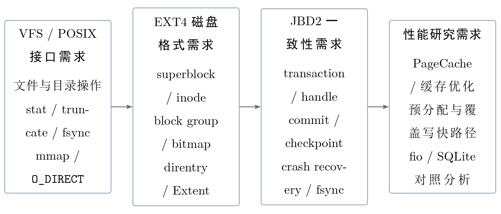

### 2.2 项目目标

本项目的总体目标是在 Asterinas 上实现一个兼容 POSIX、支持 EXT4 核心磁盘格式与 JBD2 崩溃一致性语义的高性能文件系统，并在标准化实验环境中验证其正确性、可靠性和性能。

具体目标包括：

1. 支持 POSIX 核心接口，包括文件创建、打开、读写、定位、属性查询、截断、目录创建、删除和重命名等操作。
2. 支持 EXT4 核心磁盘格式，包括 superblock、block group、inode、direntry、Extent 树和块分配等结构。
3. 支持 JBD2 ordered 日志语义，完成事务提交、检查点写回和挂载时恢复。
4. 接入 Asterinas 的 PageCache、Vmo、bio 和块设备接口，打通 buffered I/O、mmap、fsync、O_DIRECT 和并发读写路径。
5. 在 QEMU/KVM + virtio-blk 环境下，与 Linux EXT4 进行同口径对照测试，并给出可复现的性能优化过程。

### 2.3 核心挑战

本项目主要面对以下几个挑战：

- **磁盘格式复杂**：EXT4 不是单一数据结构，而是由 superblock、block group、inode、direntry、Extent 和位图等结构共同组成。文件读写、扩容、截断和目录更新都需要维护这些结构之间的一致关系。
- **日志语义要求严格**：JBD2 要求元数据先进入日志，再通过 commit block 判断事务是否完整。恢复阶段只能重放已经完整提交的事务，不能把未提交的修改暴露到磁盘 home 位置。
- **数据路径较多**：buffered I/O、mmap 和 O_DIRECT 对缓存一致性的要求不同。尤其是 O_DIRECT 绕过 PageCache，必须处理 direct I/O 与 PageCache、Extent 映射和文件大小之间的关系。
- **性能和一致性互相影响**：fsync、flush 和日志提交会增加 I/O 延迟，但直接省略这些步骤会破坏崩溃一致性。项目需要在保证正确性的前提下减少重复元数据读取、重复映射查询和不必要的锁串行化。
- **并发路径容易出错**：多线程同时读写文件、rename、truncate 或 fsync 时，需要明确锁序和事务边界，避免死锁、数据错乱和元数据状态不一致。

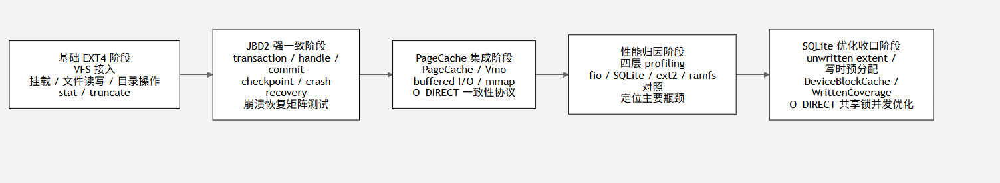

## 三、系统设计与实现

### 3.1 总体架构

本项目采用分层架构组织 EXT4 文件系统。整体上可以分为五层：

1. **应用与系统调用层**：运行用户程序、测试程序和数据库负载，通过 Linux ABI 访问文件系统。
2. **Asterinas VFS 集成层**：负责 inode、dentry、file、PageCache、Vmo、mmap 和 O_DIRECT 等内核对象适配。
3. **EXT4 核心语义层**：解释 EXT4 磁盘结构，完成 inode、目录项、Extent、块分配和文件大小更新。
4. **JBD2 一致性层**：负责元数据日志、事务提交、检查点写回和挂载时恢复。
5. **块设备适配层**：通过 Asterinas block layer 和 virtio-blk 设备提交实际 I/O。

代码组织上，Asterinas 内核集成部分主要位于 `kernel/src/fs/ext4/`，EXT4 与 JBD2 核心库主要位于 `kernel/libs/ext4_rs/`。其中 `kernel/src/fs/ext4/fs.rs` 中的 `Ext4Fs` 是运行时核心对象，集中保存 EXT4 实例、块设备、JBD2 runtime、PageCache 状态、目录项缓存、Extent 映射缓存、direct read cache、WrittenCoverage、profiling 统计和各类锁结构。

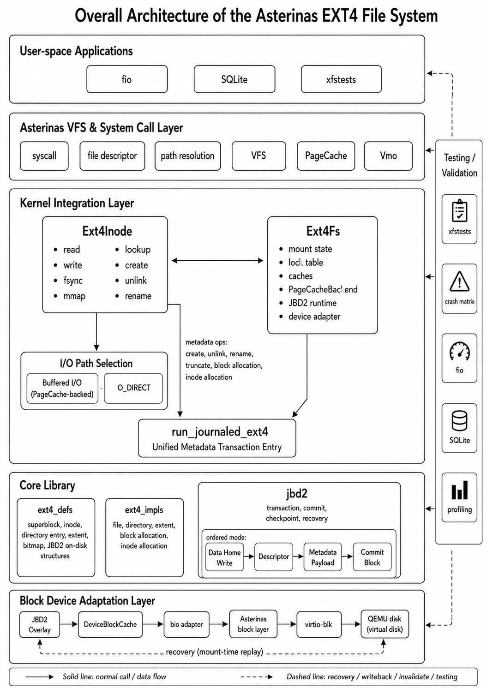

从调用链看，应用程序通过 Linux ABI 发起系统调用，Asterinas VFS 将请求分发到 EXT4 inode/file 操作。普通读写优先进入 PageCache 和 Vmo 路径，O_DIRECT 则绕过 PageCache，直接准备 Extent 映射并向 block layer 提交 bio。涉及元数据变更的操作会进入统一事务入口，由 JBD2 handle 记录元数据块并在提交阶段写入 journal。

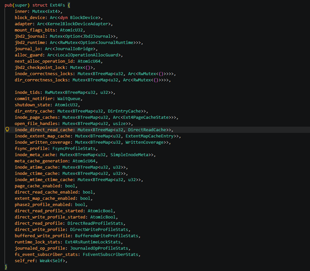

### 3.2 主要模块

| 模块 | 主要位置 | 说明 |
| --- | --- | --- |
| VFS 适配 | `kernel/src/fs/ext4/inode.rs`、`kernel/src/fs/ext4/fs.rs` | 负责文件、目录、属性、截断、fsync、mmap、O_DIRECT 等接口接入 |
| EXT4 磁盘结构 | `kernel/libs/ext4_rs/src/ext4_defs/` | 定义 superblock、inode、direntry、Extent、JBD2 block 等磁盘结构 |
| EXT4 核心实现 | `kernel/libs/ext4_rs/src/ext4_impls/` | 实现块组、inode、目录、Extent 映射、文件读写和分配逻辑 |
| JBD2 日志 | `kernel/libs/ext4_rs/src/ext4_impls/jbd2/` | 实现 handle、transaction、commit、checkpoint、recovery 和 journal space 管理 |
| 缓存与优化 | `kernel/src/fs/ext4/fs.rs` | 实现 DeviceBlockCache、inode 元数据缓存、Extent 映射缓存、WrittenCoverage 等优化 |
| 测试程序 | `test/initramfs/src/syscall/` | 包含 xfstests 适配、自研并发测试和崩溃一致性测试 |
| 测试脚本 | `tools/ext4/` | 提供 fio、SQLite、crash、xfstests 等测试入口 |

### 3.3 EXT4 核心功能

EXT4 核心结构部分主要基于开源 `ext4_rs` 的磁盘格式解析能力扩展而来。本项目在其基础上补齐了内核文件系统运行时需要的路径，包括 inode 生命周期、目录项更新、Extent 插入和合并、块分配、文件扩容、truncate、fsync 和并发读写等逻辑。

Extent 是项目中的重点实现之一。相比直接块映射，Extent 以连续区间描述文件逻辑块到物理块的关系，更适合大文件和顺序 I/O。项目实现了 Extent Header、Extent Index、Extent Leaf 的解析和更新，并支持在文件扩展时插入、合并和必要时分裂 Extent。对于 SQLite 和 fio 这类负载，Extent 路径的性能直接影响读写吞吐和 fsync 延迟。

目录操作方面，系统支持目录项查找、创建、删除和重命名等主路径。rename、unlink、mkdir 等操作涉及多个 inode 和目录项更新，项目将这些元数据修改统一纳入 JBD2 事务边界，避免部分元数据已经写盘而另一部分丢失造成目录结构不一致。

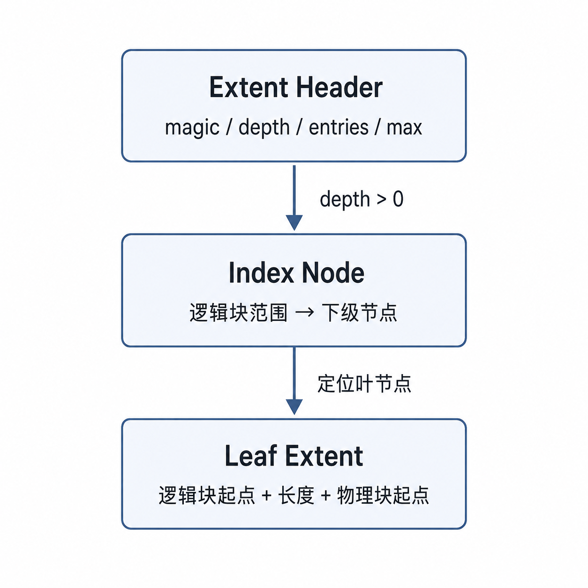

### 3.4 JBD2 日志与崩溃恢复

JBD2 是本项目一致性实现的核心。开源 `ext4_rs` 原本没有完整日志机制，元数据变更可以直接写入磁盘。本项目新增 transaction、handle、commit、checkpoint、recovery、journal space 等模块，使元数据更新先写入日志，再通过检查点写回 home 位置。

项目采用 ordered 模式。数据块不进入日志，元数据进入日志；提交时先写 descriptor 和 metadata payload，再执行设备同步，最后写 commit block。恢复阶段扫描 journal，只重放已经写入完整 commit block 的事务。这样可以保证系统在崩溃后不会重放半提交事务。

在 Asterinas 集成层中，元数据修改通过统一的事务入口收敛到 JBD2。文件创建、目录更新、truncate、Extent 更新、inode 元数据修改等操作都在事务边界内完成。这样做的好处是逻辑清晰：能恢复的修改必须已经提交，不能恢复的修改不会被恢复过程错误重放。


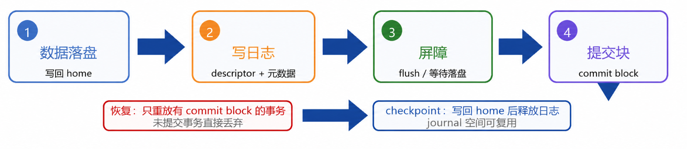

JBD2 路径的实现重点包括：

- **handle 边界**：每次元数据修改通过 handle 声明修改块，使调用点不需要关心日志内部布局。
- **transaction 状态机**：区分 running、committing、checkpointing 等阶段，避免新修改进入正在提交的事务。
- **commit block 判定**：恢复阶段以 commit block 作为事务完整性的边界，未完整提交的事务不会重放。
- **checkpoint 写回**：已提交事务中的元数据最终写回 home block，并释放 journal 空间。
- **挂载恢复**：文件系统挂载时扫描 journal，恢复完整事务后再进入正常读写状态。

### 3.5 缓存体系与 I/O 协同

为了减少重复读盘和重复树遍历，项目在 EXT4 路径上实现了多类缓存：

- `inode_meta_cache` 缓存 inode 的常用 stat 元数据，减少重复读取 inode 所在块。
- `inode_extent_map_cache` 缓存逻辑块到物理块的映射，减少 Extent 树下沉开销。
- `DeviceBlockCache` 缓存设备 home block 的 write-through 镜像，使元数据块读取可以大量命中内存。
- `WrittenCoverage` 记录每个 inode 已写入区间，用于快速判断 O_DIRECT 覆盖写是否会改变文件映射。
- `PageCache` 支撑 buffered I/O 和 mmap，负责文件数据页缓存。

其中 DeviceBlockCache 对 SQLite 负载影响最明显。SQLite speedtest1 会反复读取 inode、目录、位图和 Extent 等元数据块，如果每次都穿透到 virtio-blk，延迟会被明显放大。DeviceBlockCache 使这些 home block 的读取在内存中命中，SQLite 测试中命中率约为 98.5%，对应耗时从 1332.2s 降到 454.3s。

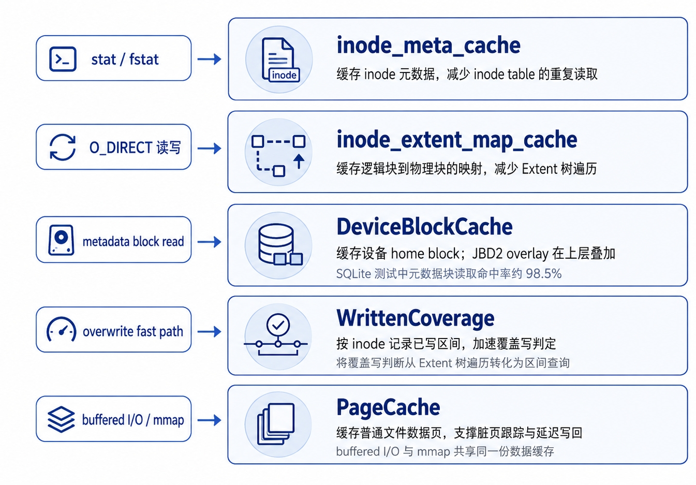

缓存一致性通过三道防线保证：写路径维护 PageCache 与磁盘映射关系，fsync 路径负责脏页和元数据持久化，O_DIRECT 路径在绕过 PageCache 时显式处理覆盖写、失效和同步边界。项目没有为了性能直接绕开 PageCache 或 JBD2，而是在这些边界上做可证明的 fast path。

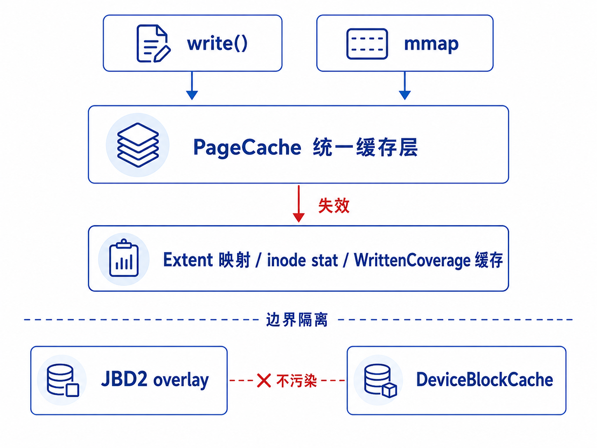

### 3.6 并发控制

项目的并发控制主要围绕两个目标展开：保证正确性和减少不必要的串行化。

第一，系统为多 inode 操作设置了稳定锁序。涉及多个 inode 或目录时，按照 inode 号排序获取对象锁，避免 ABBA 死锁。元数据修改进入 JBD2 前，也按照固定顺序进入 inode/dir 锁、JBD2 runtime 锁和 EXT4 实例锁。

第二，对于 O_DIRECT 覆盖写场景，项目将部分 per-inode 互斥路径改为共享锁。fio 多线程写同一个文件时，测量前文件已经预分配完整 Extent，测量阶段大多是覆盖写，不需要改变映射。项目在 page_cache=0 场景下先用共享锁判断是否命中覆盖写，命中后直接并行提交 bio；只有需要分配新块或改变映射时，才退回独占路径。

这一优化使同文件并发写在 numjobs=2 和 numjobs=4 场景下达到 Linux EXT4 的 165% 和 187%。这说明性能瓶颈不只来自块设备，也来自文件系统锁粒度和映射准备路径。

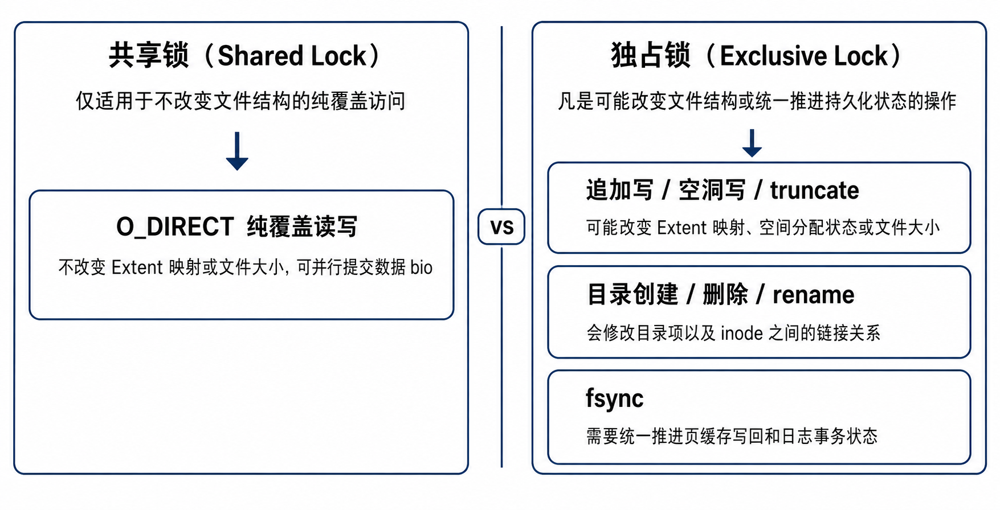

## 四、测试与评估

### 4.1 测试环境

项目主要在 QEMU/KVM + virtio-blk 环境中测试，并使用 Linux EXT4 作为同口径对照。测试内容包括：

- xfstests 重点子集，用于验证 POSIX 和 EXT4 行为兼容性。
- JBD2 Crash Matrix 和 host-crash fsync 测试，用于验证崩溃恢复。
- 自研并发 hash 测试和 xfstests concurrency，用于验证并发正确性。
- fio O_DIRECT 和参数扫描，用于评估顺序读写、块大小、numjobs 和 fsync 等因素。
- SQLite speedtest1，用于评估真实数据库负载。

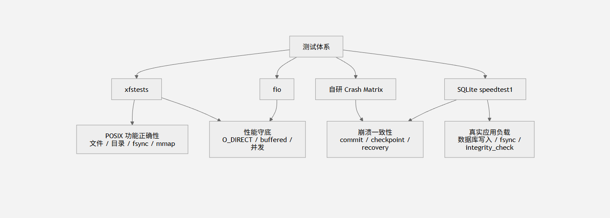

### 4.2 xfstests 功能与兼容性测试

项目没有声称已经通过 official xfstests 全量测试，而是围绕当前功能完成度选择了重点子集。当前阶段的结论是：项目通过了赛题核心路径相关的 xfstests 重点子集，并且这些子集当前均为 0 FAIL。

| 测试集合 | 结果 | 主要覆盖内容 |
| --- | --- | --- |
| phase3 base guard | 9 PASS / 0 FAIL / 7 NOTRUN | 基础文件、目录和回归保护 |
| phase4 good | 11 PASS / 0 FAIL / 7 NOTRUN | PageCache、目录、fsync 和 EXT4 主路径 |
| phase6 good | 24 PASS / 0 FAIL / 1 NOTRUN | create、open、read、write、truncate、stat、rename、unlink、ENOSPC 等 |
| pagecache phase4 | 9 PASS / 0 FAIL / 4 NOTRUN | PageCache、mmap、O_DIRECT 协同路径 |
| jbd phase1 | 6 PASS / 0 FAIL / 6 NOTRUN | JBD2 基础恢复和 EXT4 日志路径 |
| fsync durability tier1 | 11 PASS / 0 FAIL / 1 NOTRUN | fsync/fdatasync 持久化语义 |
| concurrency | 10 PASS / 0 FAIL | 多线程读写、fsstress 和并发压力场景 |

部分用例标记为 NOTRUN，主要原因是当前项目尚未实现或暂不覆盖 hardlink、symlink、debugfs、device-mapper、quota、AIO、特殊挂载选项等能力。这些不属于当前版本已经声明完成的范围，后续会随着 POSIX 边界补齐继续推进。

### 4.3 崩溃一致性测试

崩溃一致性测试采用“准备阶段写入 - 注入崩溃 - 恢复阶段验证”的方式进行。测试脚本先创建 EXT4 镜像并执行目标操作，在 JBD2 commit 或 replay hold 等关键位置等待；随后从宿主机杀掉 QEMU，模拟系统异常退出；最后重新启动同一磁盘镜像，触发挂载时 JBD2 recovery，并验证文件内容、文件大小、目录项、rename 结果和 fsync 持久化状态。

当前结果如下：

| 测试项 | 结果 | 说明 |
| --- | --- | --- |
| JBD2 Crash Matrix | 18/18 PASS | 9 类场景重复验证 2 次，覆盖 create_write、rename、truncate_append、large_write、fsync_durability 等 |
| host-crash fsync | 4/4 PASS | 覆盖 fsync size durability、fdatasync metadata、rename fsync dst、concurrent fsync |
| fsync durability xfstests | 11 PASS / 0 FAIL / 1 NOTRUN | 与标准 fsync/fdatasync 语义测试结合验证 |
| SQLite integrity | PASS | SQLite speedtest1 后执行 `PRAGMA integrity_check` 通过 |

这些测试说明当前 JBD2 ordered 模式、commit block 判定、checkpoint 写回和挂载恢复流程能够支撑项目已覆盖的崩溃一致性场景。


### 4.4 并发正确性测试

并发正确性由两类测试共同验证。

第一类是项目自研的确定性 hash 测试。测试程序启动多个 worker 并发创建文件、写入固定模式数据、执行同文件覆盖写或多文件写入，结束后重新读取文件并计算 hash。期望 hash 由 seed、worker 编号和 round 决定，因此只要并发过程中出现覆盖错乱、丢写或顺序错误，最终 hash 就会不一致。当前自研并发测试 7/7 PASS。

第二类是 xfstests concurrency 子集。该集合覆盖 fsstress、并发读写、rename/unlink 压力和多线程目录操作等场景，当前结果为 10/10 PASS。它的作用是提供更接近 Linux 文件系统测试习惯的标准压力验证。

因此，本项目的并发结论不是只依赖单一测试。自研测试重点验证数据正确性，xfstests concurrency 重点验证标准压力场景，两者共同说明当前锁序设计、共享锁覆盖写路径和 PageCache/direct I/O 一致性协议在重点并发场景下能够保持正确。


### 4.5 性能测试结果

#### fio O_DIRECT 顺序读写

fio O_DIRECT 测试用于评估文件系统基础 I/O 能力。当前版本在 4 KiB 到 1 MiB 块大小下，读写性能已经接近 Linux EXT4，部分场景超过 Linux EXT4。

| 块大小 | 读取相对 Linux EXT4 | 写入相对 Linux EXT4 |
| --- | --- | --- |
| 4 KiB | 约 82%-86% | 约 75%-76% |
| 16 KiB | 约 84%-86% | 约 75%-76% |
| 64 KiB | 约 87%-88% | 约 81%-84% |
| 256 KiB | 约 90%-95% | 约 121% |
| 1 MiB | 约 122%-140% | 约 82%-88% |

这些结果说明，在顺序 direct I/O 场景下，当前系统的 bio 提交、大块 I/O 和 Extent 映射路径已经具备较好的性能基础。


#### 同文件并发写

同文件并发写是本项目优化效果最明显的场景之一。通过 O_DIRECT 覆盖写共享锁和 WrittenCoverage 快速判定，系统减少了同一 inode 上不必要的互斥锁等待。

| 场景 | 优化前 | 优化后 | 相对 Linux EXT4 |
| --- | --- | --- | --- |
| numjobs=2 写同一文件 | 约 2708 MB/s | 约 6024 MB/s | 约 165% |
| numjobs=4 写同一文件 | 约 2724 MB/s | 约 5139 MB/s | 约 187% |

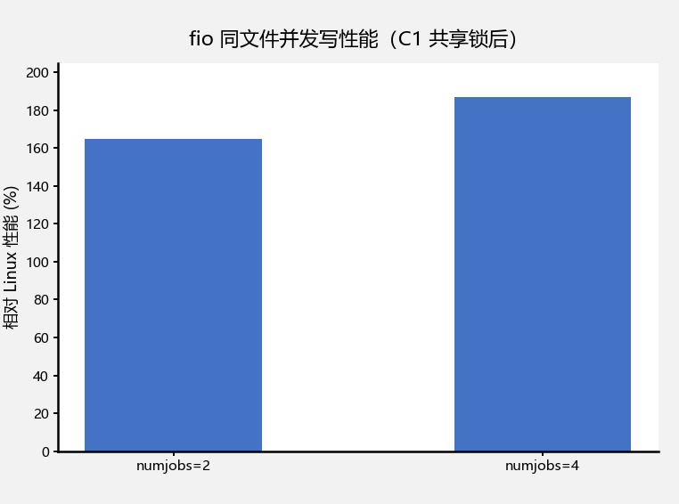

#### SQLite speedtest1

SQLite speedtest1 是更接近真实应用的数据库负载，包含大量小事务、文件扩展、索引构建、元数据更新和 fsync。当前版本从初始 2022s 优化到 234.9s，整体提升约 7.4 倍。

| 阶段 | 耗时 | 说明 |
| --- | --- | --- |
| 初始版本 | 约 2022s | 大量元数据读盘、Extent 查询和小粒度写回 |
| unwritten extent + 预分配 | 约 1332.2s | 减少追加写频繁分配开销 |
| DeviceBlockCache | 约 454.3s | 元数据块读取大量命中内存 |
| WrittenCoverage 写快路径 | 约 243.9s | 覆盖写减少重复 Extent 查询 |
| 当前版本 | 约 234.9s | lean prepare 等细化优化后结果 |

当前 SQLite 性能约为 Linux EXT4 的 21.92%。该结果相比初始版本有明显提升，但距离 Linux EXT4 仍有差距。主要原因是 SQLite 属于 fsync 密集型真实负载，频繁触发小写入、元数据更新、日志提交和同步刷盘；Linux EXT4 在 delayed allocation、background writeback、journal group commit 和块层调度方面积累了大量优化，而当前实现为了保证一致性采取了较保守的提交与写回策略。后续优化会重点围绕延迟分配、后台写回和日志合并提交继续推进。


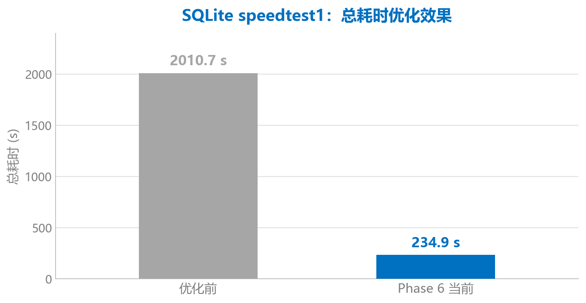

### 4.6 正确性守底策略

项目中的性能优化不是单独看吞吐数据。每次关键优化后，都会回归崩溃一致性、fsync、并发正确性、xfstests 重点子集和 SQLite integrity。这样可以避免为了性能绕开 JBD2、fsync 或缓存一致性约束。

当前测试闭环可以概括为：

- 功能语义由 xfstests 重点子集验证。
- 崩溃恢复由 JBD2 Crash Matrix 和 host-crash fsync 验证。
- 并发数据正确性由自研 hash 测试和 xfstests concurrency 验证。
- 真实应用结果由 SQLite speedtest1 和 `PRAGMA integrity_check` 验证。
- 性能结论由 fio、参数扫描和 Linux EXT4 对照验证。

## 五、关键优化方法

### 5.1 四层延迟归因

项目没有直接凭经验修改性能路径，而是使用分层归因方法定位瓶颈：

1. 通过 fio O_DIRECT 测试观察基础块设备和 direct I/O 能力。
2. 通过 EXT4/EXT2/ramfs 对照区分日志、块设备和文件系统路径开销。
3. 通过 profiling 统计定位 Extent 查询、元数据读取、fsync、bio 提交和锁等待。
4. 通过 SQLite speedtest1 验证真实应用负载下的整体效果。

这种方法使优化目标比较明确。例如，SQLite 初期耗时主要不是普通数据写入，而是重复元数据读取和映射准备开销，因此 DeviceBlockCache、WrittenCoverage 和 Extent 映射缓存带来了明显收益。


### 5.2 主要优化点

- **Extent 映射缓存**：缓存逻辑块到物理块映射，减少重复 Extent 树查询。
- **inode 元数据缓存**：减少 stat、mtime、ctime、size 等元数据反复读盘。
- **unwritten extent + 写时预分配**：降低追加写场景下每 4 KiB 都走分配慢路径的开销。
- **连续脏页批量写回**：在 fsync 路径中减少逐页 handle 和小 bio 提交。
- **fsync 保留 clean 页**：避免每次 fsync 后丢掉整个工作集。
- **DeviceBlockCache**：缓存设备 home block 的 write-through 镜像，使元数据读取更多命中内存。
- **WrittenCoverage**：把覆盖写判定从多次 Extent 查询变成 BTreeMap 区间查询。
- **O_DIRECT 共享锁覆盖写**：在不改变文件映射的并发覆盖写场景下允许多个 writer 并行提交 I/O。

这些优化共同推动 SQLite 从 2022s 降到 234.9s，也使 fio O_DIRECT 和并发覆盖写达到当前结果。

### 5.3 典型优化路径说明

#### DeviceBlockCache：减少元数据读盘

SQLite speedtest1 会反复访问 inode block、目录 block、位图 block 和 Extent 元数据。如果每次读取都进入 virtio-blk，单次延迟虽然不大，但在几十万次小事务中会被持续放大。DeviceBlockCache 在块设备适配层维护 home block 的 write-through 镜像：写入仍然正常下发到底层设备，读取则优先命中内存镜像。这样既保留了 JBD2 overlay 下的磁盘语义，又显著降低了元数据读取延迟。

#### WrittenCoverage：把覆盖写判定变成区间查询

fio 和 SQLite 中存在大量“文件块已经分配，只是覆盖写已有区域”的情况。传统路径每次写入都可能重新查询 Extent 树并进入较重的准备流程。WrittenCoverage 为每个 inode 维护已经写入并完成映射准备的区间集合，当写入落在已覆盖区间内时，可以快速判断这次写入不会改变文件映射，从而跳过重复的分配和映射准备。

#### O_DIRECT 共享锁 fast path：释放同文件并发写能力

初始实现中，同一 inode 的写路径被互斥锁串行化。对于同文件 O_DIRECT 覆盖写，这种串行化并没有必要，因为测量阶段不改变文件大小，也不改变 Extent 映射。项目将该路径拆成“共享锁验证 + 并行 bio 提交”的 fast path，仅在写入会改变映射或文件大小时退回独占路径。


这些优化有一个共同原则：不以破坏一致性换性能。只要路径会修改元数据、改变文件大小、分配新块或影响 fsync 语义，就必须进入 JBD2 和独占保护；只有能证明是纯覆盖、纯读取或缓存命中的场景，才使用 fast path。

## 六、运行与复现

以下命令用于复现主要测试。不同机器的绝对耗时可能有差异，但 PASS/FAIL 结果和相对趋势应保持一致。

### 6.1 崩溃一致性测试

```bash
PHASE4_DOCKER_MODE=crash_only ./tools/ext4/run_phase4_in_docker.sh
```

### 6.2 并发正确性测试

```bash
PHASE4_DOCKER_MODE=concurrency ./tools/ext4/run_phase4_in_docker.sh
```

### 6.3 fsync/fdatasync 语义测试

```bash
PHASE4_DOCKER_MODE=jbd_phase3_fsync_flush ./tools/ext4/run_phase4_in_docker.sh
```

### 6.4 fio O_DIRECT 测试

```bash
EXT4_DIRECT_READ_CACHE=0 EXT4_PAGE_CACHE=0 EXT4_JBD2_ENABLE=1 \
  ./tools/ext4/run_phase4_part2.sh
```

### 6.5 SQLite speedtest1 测试

```bash
FS_LIST=ext4 PAGE_CACHE_LIST=1 JBD2_LIST=1 \
  ./tools/ext4/run_sqlite_speedtest.sh
```

### 6.6 official xfstests 适配入口

```bash
./tools/ext4/run_official_xfstests.sh
```

## 七、项目目录

```text
.
├── kernel/
│   ├── src/fs/ext4/
│   │   ├── fs.rs                 # Asterinas EXT4 运行时对象、缓存、事务入口和优化统计
│   │   └── inode.rs              # VFS inode/file 操作、PageCache、mmap、O_DIRECT 路径
│   └── libs/ext4_rs/
│       ├── src/ext4_defs/        # EXT4/JBD2 磁盘结构定义
│       └── src/ext4_impls/       # EXT4 核心逻辑、Extent、JBD2、分配器和文件操作
├── test/initramfs/src/syscall/
│   ├── xfstests/                 # xfstests 适配与测试清单
│   ├── ext4_crash/               # 崩溃一致性测试程序
│   └── ext4_phase2/              # 自研并发正确性测试
├── tools/ext4/                   # 构建、运行、crash、fio、SQLite、xfstests 测试脚本
├── docs/                         # 性能报告、技术报告和比赛文档
└── benchmark/                    # 测试日志和结果汇总
```

## 八、已知限制与后续工作

当前版本已经完成赛题核心路径和重点测试验证，但仍有一些边界需要继续补齐：

1. **JBD2 revoke 记录仍需完善**  
   当前实现已经支持 JBD2 事务提交、checkpoint 和恢复，但 revoke block 记录尚未完整写入 journal。后续需要补齐块释放后防止旧事务重放的语义。

2. **hardlink、symlink 等 POSIX 边界还未完全覆盖**  
   当前重点实现普通文件、目录、rename、truncate、fsync、mmap 和 O_DIRECT 等主路径。hardlink、symlink、quota、特殊挂载选项等功能仍在后续计划中。

3. **official xfstests 全量通过率仍需继续提高**  
   目前通过的是与当前实现强相关的重点子集，未声明官方全量测试已经完成。后续会随着 POSIX 边界补齐继续扩大测试范围。

4. **SQLite 与 Linux EXT4 仍有性能差距**  
   当前 SQLite speedtest1 已提升约 7.4 倍，但仍约为 Linux EXT4 的 21.92%。后续需要继续研究 delayed allocation、background writeback、journal group commit 和更细粒度的提交合并。

5. **极端 ENOSPC 和异常路径还需要加固**  
   当前已覆盖部分 ENOSPC 行为，但元数据写到一半时的 shutdown/read-only 保护仍需进一步完善。

6. **host power-loss 模型需要继续收紧**  
   当前 host-crash 测试基于 virtio sync write 顺序和 QEMU/KVM 行为。后续可以进一步加入更强的块层乱序和掉电模型测试。

## 九、参考资料

- [Asterinas](https://github.com/asterinas/asterinas)：本项目运行的 Rust framekernel 操作系统。
- [yuoo655/ext4_rs](https://github.com/yuoo655/ext4_rs)：本项目参考的开源 Rust EXT4 实现，主要提供 EXT4 盘上结构和基础实现思路。
- Linux EXT4/JBD2 文档：用于理解 EXT4 ordered 模式、日志提交、checkpoint 和 recovery 行为。
- xfstests：Linux 文件系统常用回归测试框架，用于验证文件系统接口和兼容性。
- SQLite speedtest1：SQLite 官方性能测试程序，用于评估真实数据库负载下的文件系统表现。
