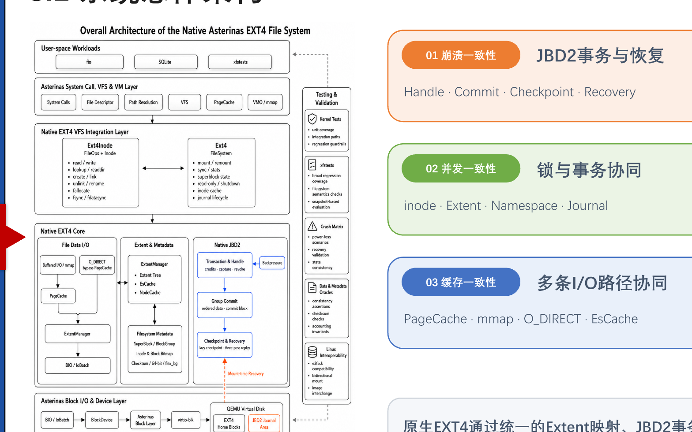
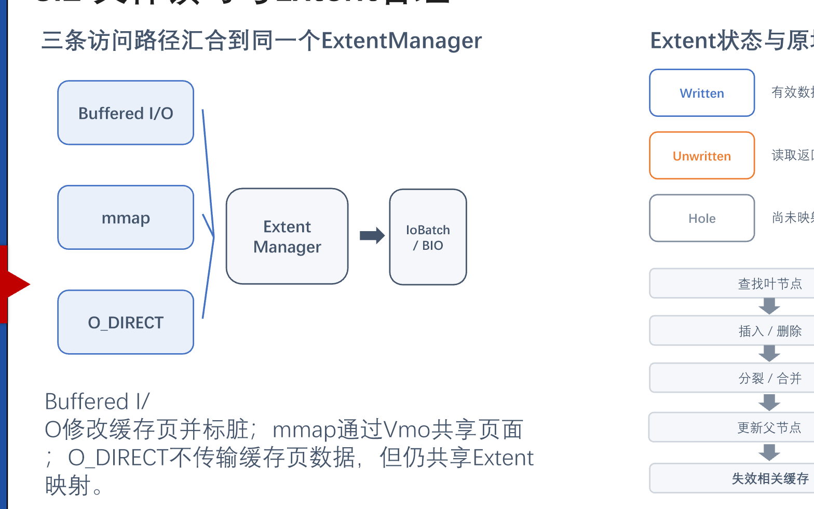
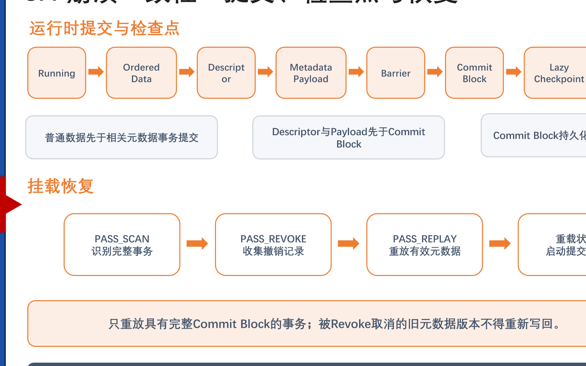
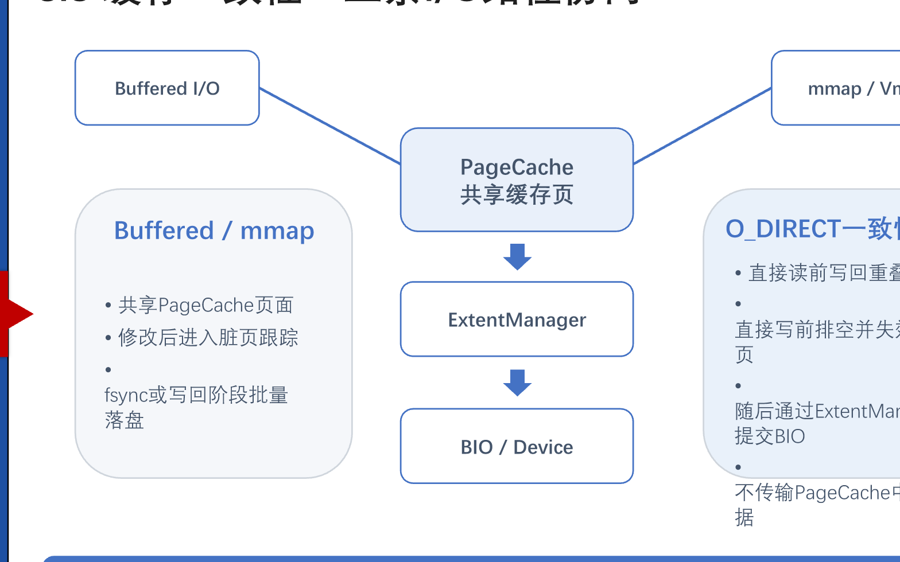
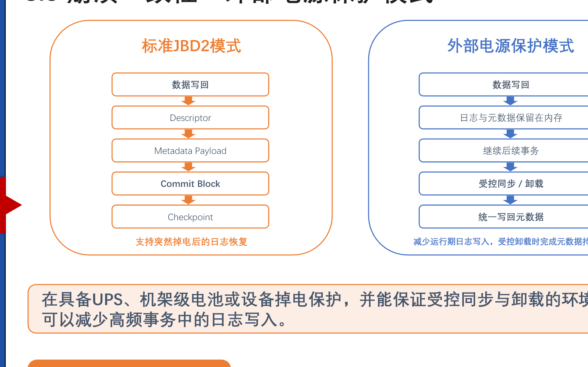
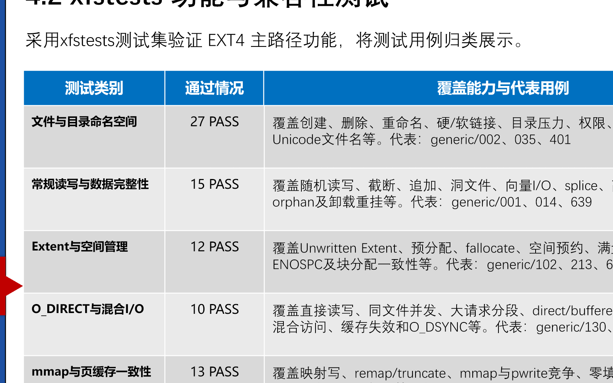
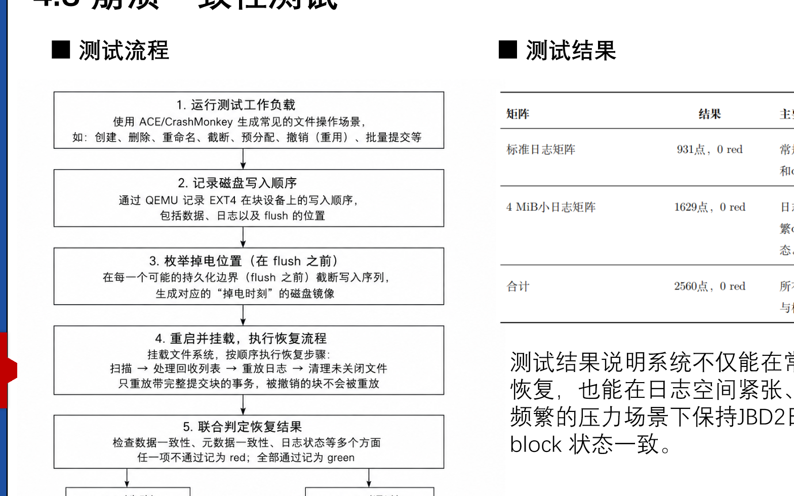
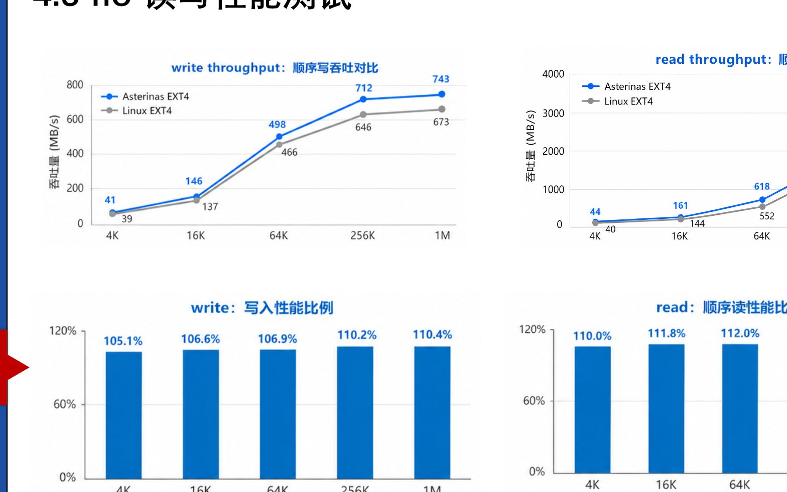
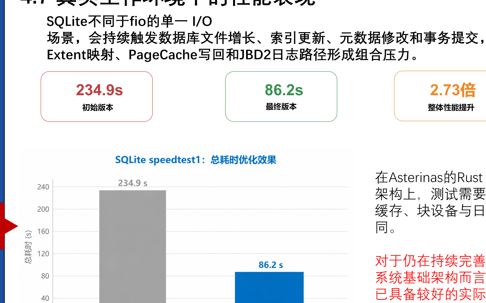

# Asterinas EXT4 - 面向 RustOS 的高性能强一致性 EXT4 文件系统

> 2026 年全国大学生计算机系统能力大赛操作系统设计赛
>
> 赛题方向：Research on High-Performance and Strong-Consistency File System for RustOS

## 项目目录

- [一、基本信息](#一基本信息)
- [二、项目背景与目标](#二项目背景与目标)
- [三、系统设计与实现](#三系统设计与实现)
- [四、测试与评估](#四测试与评估)
- [五、性能优化与创新](#五性能优化与创新)
- [六、运行与复现](#六运行与复现)
- [七、项目目录](#七项目目录)
- [八、AI 使用说明](#八ai-使用说明)
- [九、已知限制与后续工作](#九已知限制与后续工作)
- [十、参考资料](#十参考资料)

## 一、基本信息

### 1.1 项目信息

| 项目 | 内容 |
| --- | --- |
| 项目名称 | 面向 RustOS 的高性能强一致性 EXT4 文件系统 |
| 运行平台 | Asterinas Rust framekernel 操作系统 |
| 队伍名称 | 日志写了吗 |
| 所属高校 | 哈尔滨工业大学（深圳） |
| 队伍成员 | 俞杰、梁丙煜、王毅航 |
| 校内导师 | 夏文、李诗逸 |
| 主要语言 | Rust |

### 1.2 项目简介

本项目在 Asterinas Rust framekernel 操作系统中实现原生 EXT4 文件系统，使 RustOS 能够使用标准 EXT4 磁盘格式承载真实 Linux 应用负载。系统完成了 POSIX 核心接口、目录操作、inode 与块分配、Extent 映射、PageCache、Buffered I/O、mmap、O_DIRECT、fsync/fdatasync，以及 JBD2 ordered 日志与崩溃恢复等主路径。

项目的核心问题不是单纯完成文件读写，而是在 RustOS 中同时处理三类一致性约束：元数据在崩溃后的可恢复性、Buffered I/O/mmap/O_DIRECT 之间的缓存可见性，以及多线程读写时的运行时竞争安全。在保证这些约束的前提下，项目进一步优化 Extent 映射、缓存、批量 I/O、事务持有时间和高频 fsync 路径，并以 xfstests、崩溃矩阵、数据 oracle、Linux 双向互操作、fio 与 SQLite speedtest1 建立验证闭环。

### 1.3 项目亮点

- **安全 Rust 中的原生 EXT4**：在 Asterinas 内核中完成 EXT4 盘面解析、VFS 接入、空间管理、缓存协同和块设备 I/O，不依赖外部文件系统实现。
- **完整 JBD2 生命周期**：实现 Handle、credits、Transaction、ordered data、descriptor、commit block、checkpoint、revoke、恢复和异常中止等关键流程。
- **三条 I/O 路径的一致性协议**：Buffered I/O、mmap 与 O_DIRECT 共享 Extent 映射和缓存可见性规则，避免缓冲页与磁盘数据出现新旧不一致。
- **可验证的崩溃恢复**：覆盖标准 journal 的 931 个崩溃点和 4 MiB 小 journal 的 1629 个崩溃点，均通过恢复与一致性检查。
- **真实性能结果**：顺序 fio I/O 达到 Linux EXT4 的 105.1%-113.4%；同文件并发写在 `numjobs=2/4` 下分别达到 Linux EXT4 的 103% 和 111%；SQLite speedtest1 从 234.9s 降至 86.2s。
- **掉电保护场景的可选优化**：在可靠外部供电并可保证受控同步、卸载的条件下，提供延后 journal 和元数据写回的模式；高频 fsync 写性能提升 80.59%-154.81%，默认模式仍保持标准 JBD2 持久化语义。

### 1.4 完成情况概览

| 方向 | 当前结果 | 验证依据 |
| --- | --- | --- |
| EXT4 与 POSIX 主路径 | 已完成 | xfstests 覆盖命名空间、常规读写、Extent、O_DIRECT 与 mmap 等主路径 |
| JBD2 日志与恢复 | 已完成 | 标准 journal 931 点、4 MiB 小 journal 1629 点崩溃矩阵均为 0 red |
| 多路径缓存一致性 | 已完成 | direct/buffered 混合 I/O、PageCache、mmap 与 O_DIRECT 专项验证 |
| 并发正确性 | 已完成重点验证 | fsstress、同文件 direct/buffered 竞争、死锁压力和状态观察均 PASS |
| Linux 互操作 | 已完成 | Linux 创建的镜像可由 Asterinas 读写；Asterinas 修改后的镜像可由 Linux 挂载并检查 |
| 性能优化 | 已形成结果 | fio 顺序 I/O 接近或超过 Linux EXT4，SQLite 真实负载优化至 86.2s |

### 1.5 分工说明

| 成员 | 主要工作 |
| --- | --- |
| 俞杰 | EXT4/JBD2 核心设计、崩溃一致性验证、比赛材料整理 |
| 梁丙煜 | Asterinas VFS、PageCache/mmap/O_DIRECT 路径接入与性能优化 |
| 王毅航 | xfstests 适配、并发测试、fio/SQLite 测试脚本与结果分析 |

### 1.6 文档索引

- [性能测试说明](test/bench/README.md)：性能计分板跑批、台账与结果口径。
- [崩溃协议测试集](test/crash/protocol/README.md)：JBD2 协议点崩溃测试的场景与运行方式。
- `docs/image/`：README 使用的架构图、测试流程和性能图表。
- `docs/aiuse/`：AI 使用说明与各阶段使用记录，后续由参赛队补充维护。

## 二、项目背景与目标

### 2.1 项目背景

文件系统是 AI 训练 checkpoint、数据库日志与数据页、对象存储元数据等应用最终落到持久化设备的关键层。它需要向上提供 POSIX 文件、目录、权限和同步语义，向下管理块分配、空间回收与数据组织，并在系统异常、掉电或应用崩溃后恢复到一致状态。

EXT4 长期支撑服务器、数据库、中间件、虚拟机、容器和嵌入式设备等 Linux 工作负载。将 EXT4 引入 Asterinas，既能补齐 RustOS 的本地磁盘文件系统能力，也为真实 Linux 应用生态提供标准磁盘格式、成熟工具链与可靠恢复机制。

### 2.2 项目目标

1. 在 Asterinas 上实现标准 EXT4 磁盘格式与 POSIX 核心文件系统接口。
2. 实现 JBD2 ordered 日志语义，使元数据更新具备提交、检查点和崩溃恢复能力。
3. 打通 PageCache、Buffered I/O、mmap、O_DIRECT、fsync/fdatasync 与块设备 I/O 路径。
4. 通过 xfstests、崩溃恢复、数据 oracle、Linux 互操作和并发测试验证正确性。
5. 在统一 QEMU/KVM + virtio-blk 环境中与 Linux EXT4 对照，评估 fio 与 SQLite 真实负载性能。

### 2.3 核心挑战

| 挑战 | 说明 |
| --- | --- |
| EXT4 盘面结构 | superblock、block group、inode、目录项、Extent 与位图必须保持相互一致。 |
| 崩溃一致性 | 日志、写入顺序、flush、checkpoint 与 recovery 共同决定崩溃后能否恢复。 |
| 多路径缓存协同 | Buffered I/O、mmap 和 O_DIRECT 的数据传输方式不同，但必须共享一致的文件映射和可见性语义。 |
| 并发与锁序 | namespace、多 inode、Extent、Journal 和缓存对象需要稳定锁序，避免死锁与状态错乱。 |
| 性能与语义平衡 | journal、fsync、缓存失效和结构锁保障正确性，也会增加高性能设备上的软件路径开销。 |

## 三、系统设计与实现

### 3.1 总体架构

系统通过统一的 Extent 映射、JBD2 事务和分层缓存，将 VFS 语义连接到块设备持久化。设计重点是三类一致性：JBD2 保证崩溃后可恢复，锁与事务协同保证并发安全，PageCache/mmap/O_DIRECT 协同保证缓存可见性。



代码位于 `kernel/src/fs/fs_impls/ext4/`。其中 `fs.rs` 管理运行时 EXT4 对象和事务入口，`impl_for_vfs/` 完成 VFS 适配，`inode/extent_manager/` 维护 Extent 映射，`journal/` 实现 JBD2 提交、检查点、revoke 与恢复。

### 3.2 文件读写与 Extent 管理

Buffered I/O、mmap 与 O_DIRECT 三条访问路径汇合至 ExtentManager：

- Buffered I/O 修改 PageCache 页并标记脏页；mmap 通过 Vmo 共享缓存页面。
- O_DIRECT 绕过 PageCache 的数据传输，但仍使用同一套 Extent 映射，并在读写前执行必要的写回、排空和失效操作。
- ExtentManager 负责查找、插入、删除、分裂和合并 Extent，同时为空间分配、缓存更新和 journal 事务提供统一边界。
- Extent 以 `written`、`unwritten` 与 `hole` 描述逻辑块映射状态。只有数据 I/O 成功后，unwritten Extent 才能转为 written。



### 3.3 JBD2 日志、检查点与恢复

所有元数据修改从统一入口申请 credits 并获取 Handle，再由 Transaction 保存本次提交的元数据版本。文件创建、Extent 分配、位图更新和 inode 修改等多块更新被放入同一事务边界，避免只完成部分修改而留下不一致盘面。

项目采用 JBD2 ordered 模式：相关普通数据先落盘，再依次写入 descriptor、metadata payload、barrier 和 commit block。只有 commit block 已完整持久化的事务才具备恢复资格；挂载恢复依次执行 `PASS_SCAN`、`PASS_REVOKE` 和 `PASS_REPLAY`，仅重放有效且未被 revoke 取消的元数据版本。



### 3.4 多路径缓存一致性

PageCache 支撑 Buffered I/O 与 mmap；O_DIRECT 不传输 PageCache 中的数据，但必须维护与缓存页的边界协议：直接读前写回重叠脏页，直接写前排空并失效重叠页，随后才经 ExtentManager 构造 IoBatch 与 BIO。三条路径共享映射真值和缓存可见性规则，防止读到旧数据或绕过必要的映射更新。

映射缓存方面，EsCache 记录已确认的映射语义事实，使用 `AllWritten`、`AllMapped` 与 `Unknown` 三种状态；`Unknown` 时重新遍历权威的 ExtentTree。NodeCache 缓存热点外部 Extent 节点，但不作为映射真值来源。缓存失效过度只会退回慢路径，错误命中则可能破坏块分配和 unwritten 转换，因此失效规则是正确性设计的一部分。



### 3.5 并发控制

运行时对象锁保护 inode 状态、目录命名空间、ExtentTree 和块组等共享对象；JBD2 事务保证提交与恢复顺序。多 inode 操作按 inode 号稳定加锁，避免 ABBA 死锁；Journal state 作为叶锁最后获取，提交线程不反向获取 inode 锁；EsCache 与 NodeCache 的短临界区不跨设备 I/O 或日志操作。

对于同文件 O_DIRECT 写路径，当前实现不放宽保护结构变化的 inode 写锁，而是通过减少锁内重复映射查询、分块限制、连续 BIO 提交和更短的事务持有时间提高效率。这样既保留数据 I/O 成功后才提交映射状态的约束，也改善了并发写扩展性。

### 3.6 外部电源保护模式

标准模式遵循 JBD2 持久化语义，支持突然掉电后的日志恢复。针对 UPS、机架级电池或设备掉电保护等可靠供电环境，项目设计了可选外部电源保护模式：运行期优先保证文件数据写回，日志和部分元数据暂存内存，并在受控同步或卸载时统一持久化，从而减少高频 fsync 的重复 I/O。

该模式默认关闭。未配置可靠供电、无法保证受控同步或可能发生突然掉电时，必须使用标准 JBD2 模式；它不是对默认崩溃恢复语义的替代。



## 四、测试与评估

### 4.1 测试环境

| 项目 | 配置 |
| --- | --- |
| 宿主系统 | Ubuntu 24.04.1，Linux 6.8.0-41 |
| 虚拟化环境 | QEMU/KVM，virtio-blk 块设备 |
| 容器镜像 | `asterinas/asterinas:0.17.0-20260227` |
| 虚拟机配置 | 8 GiB 内存，单处理器 |
| 对照系统 | 相同虚拟化与块设备环境下的 Linux EXT4 |
| 测试类型 | xfstests、并发正确性、崩溃一致性、Linux 互操作、fio、SQLite speedtest1 |

### 4.2 xfstests 功能与兼容性

本项目使用 xfstests 覆盖 EXT4 主路径。当前汇总结果为 **78 PASS、2 FAIL、1 FLAKY**，通过率为 **96.3%**。README 如实保留未完全通过项，后续将继续针对 mmap 并发与 ENOSPC 边界问题加固。

| 测试类别 | 通过数量 | 覆盖能力 |
| --- | --- | --- |
| 文件与目录命名空间 | 27 PASS | create、unlink、rename、硬/软链接、目录压力、权限、时间戳、statx、Unicode 文件名 |
| 常规读写与数据完整性 | 15 PASS | 随机读写、truncate、O_APPEND、洞文件、向量 I/O、splice、高偏移访问、orphan、卸载重挂 |
| Extent 与空间管理 | 12 PASS | unwritten Extent、预分配、fallocate、空间预约、满盘重试、并发 ENOSPC、块分配一致性 |
| O_DIRECT 与混合 I/O | 10 PASS | 直接读写、同文件并发、大请求分段、direct/buffered 混合、缓存失效、O_DSYNC |
| mmap 与页缓存一致性 | 13 PASS | 映射写、remap/truncate、mmap 与 pwrite 竞争、零填充、stale read、多页重叠复制 |
| EXT4 特定行为 | 1 PASS | `statfs` 的 df/overhead 与相关选项行为 |



### 4.3 崩溃一致性与数据 oracle

崩溃测试在 JBD2 descriptor、metadata payload、commit block、checkpoint 等关键位置逐 FLUSH 注入断电，随后重启同一 EXT4 镜像，执行 JBD2 recovery、严格 `e2fsck` 与 oracle 检查。该流程既覆盖常规提交，也覆盖日志空间紧张、频繁 checkpoint 的压力场景。

| 验证项 | 结果 |
| --- | --- |
| 标准 journal 崩溃矩阵 | 931 个崩溃点，0 red |
| 4 MiB 小 journal 崩溃矩阵 | 1629 个崩溃点，0 red |
| 崩溃矩阵合计 | 2560 个崩溃点，0 red |
| WAL 检查 | 2360 个 home block after-image 匹配，无 violation |
| 盘面检查 | accounting、checksum、严格 `e2fsck` 均通过 |



### 4.4 并发正确性与 Linux 互操作

并发测试覆盖四进程 fsstress 下的 rename、unlink、mkdir、rmdir 等命名空间操作，同文件 direct writer / buffered reader 竞争，同文件 direct、sync、async I/O 死锁压力，以及持续覆盖写期间的元数据状态观察。重点场景均 PASS。

互操作方面，Linux 创建的 EXT4 镜像可由 Asterinas 挂载、读写和继续执行文件系统操作；Asterinas 修改后的镜像可由 Linux 挂载并通过一致性检查。该验证覆盖 `metadata_csum`、journal checksum v2/v3、64-bit journal tag、descriptor 与 commit record 等标准盘面语义。

### 4.5 性能评估

性能测试在与 Linux EXT4 相同的 QEMU/KVM + virtio-blk 环境中进行，以 I/O 总带宽（MB/s）和运行耗时（s）为指标。

| 场景 | 结果 |
| --- | --- |
| fio 顺序读写 | 吞吐达到 Linux EXT4 的 105.1%-113.4% |
| 同文件并发写，`numjobs=2` | 1380 MB/s，约为 Linux EXT4 的 103% |
| 同文件并发写，`numjobs=4` | 2446 MB/s，约为 Linux EXT4 的 111% |
| SQLite speedtest1 | 从 234.9s 优化至 86.2s，整体提升 2.73 倍 |
| 外部电源保护模式下的高频 fsync 写 | 相比标准 JBD2 提升 80.59%-154.81% |





## 五、性能优化与创新

### 5.1 Extent 与空间分配优化

ExtentManager 汇总三条 I/O 路径的逻辑块到物理块映射。项目通过缩短 Extent 结构修改和事务持有时间、缓存已确认的映射事实、减少重复树遍历来降低小粒度写入与频繁映射准备的开销。

### 5.2 EsCache 与 NodeCache

EsCache 不保存未经确认的结论；当映射状态为 `Unknown` 时，系统重新遍历 ExtentTree。NodeCache 仅缓存热点外部节点，并在节点写回、释放、复用或整树重建时刷新或清理。该设计将缓存优化限制在“加速已证实事实”的范围内，不用缓存替代权威的盘面映射判断。

### 5.3 批量 I/O 与并发路径优化

O_DIRECT 写路径按分块控制内存和 journal credits 使用，并将连续区间组合为 IoBatch 后提交连续 BIO。在保持 inode 写锁和 unwritten 转换顺序约束的前提下，优化重点放在减少锁内重复工作、降低映射查询成本和提高设备队列利用率。

### 5.4 面向可靠供电环境的持久化优化

外部电源保护模式是本项目面向工程部署条件的扩展：把“任意时刻突然掉电”的强假设与“可靠供电、受控关机”的实际环境区分开来。在后者中延后日志与元数据写回，减少高频 fsync 的重复持久化开销；模式通过显式配置启用，默认语义保持不变。

## 六、运行与复现

常用入口如下。完整的性能跑批口径见 [test/bench/README.md](test/bench/README.md)。

```bash
# 基础检查
make check

# 官方 xfstests 测试集
make run_kernel AUTO_TEST=conformance \
  CONFORMANCE_TEST_SUITE=xfstests \
  XFSTESTS_RUNLIST=/opt/xfstests/full.list \
  XFSTESTS_DISK_SIZE=12G MEM=8G RELEASE=1

# JBD2 崩溃矩阵（<jlang-corpus-dir> 为已准备的工作负载目录）
bash test/crash/run_matrix.sh --keep <jlang-corpus-dir>

# 性能计分板跑批
bash test/bench/run_p9_sweep.sh
```

不同设备上的绝对耗时与带宽可能存在差异；复现时应以 PASS/FAIL、崩溃恢复结果、同口径 Linux 对照趋势和脚本记录的配置为准。

## 七、项目目录

```text
.
├── kernel/
│   └── src/fs/fs_impls/ext4/     # 原生 EXT4、VFS 适配、Extent、JBD2、缓存与 I/O 协同
├── test/
│   ├── crash/                    # 崩溃矩阵、oracle、walcheck 与协议点测试
│   ├── bench/                    # 性能计分板、原始证据与跑批工具
│   └── initramfs/src/conformance/xfstests/
│                               # xfstests 用例清单与 guest 运行脚本
└── docs/
    ├── image/                    # README 图表和示意图
    └── aiuse/                    # AI 使用说明与阶段记录（待补充）
```

## 八、AI 使用说明

本项目在开发过程中使用 AI 工具辅助信息整理、代码风险检查、运行问题排查、自动化测试脚本维护和测试数据汇总。参赛队成员负责需求拆分、技术方案选择、功能代码实现与修改、测试取舍、结果验收和最终提交；AI 不替代参赛队对代码正确性、实验结果和竞赛材料真实性的责任。

| 项目 | 说明 |
| --- | --- |
| 交互与执行工具 | Claude Code（命令行交互与执行 harness） |
| 使用的大模型 | DeepSeek V4 Pro |
| 使用周期 | 2026 年 7 月至 2026 年 8 月 |
| 主要用途 | 实现思路讨论、代码风险检查、panic/timeout 日志分析、测试脚本辅助、重复测试执行和数据整理 |
| 人工责任 | 代码实现、关键修改决策、测试设计、结果复核、文档与最终提交均由队伍成员负责 |

完整 AI 使用说明与阶段记录将维护在 `docs/aiuse/` 目录。提交前请补充每个阶段的工具、模型、用途、人工审查过程和对应记录，使 README 中的说明可以追溯。

## 九、已知限制与后续工作

1. **xfstests 仍有边界用例待加固**：当前汇总为 78 PASS、2 FAIL、1 FLAKY，主要集中在 mmap 并发与 ENOSPC 等复杂边界；后续将继续缩小失败面。
2. **外部电源保护模式有明确部署前提**：该模式仅适用于可靠供电且可受控同步、卸载的环境，不能替代标准 JBD2 模式对突然掉电的保护。
3. **真实负载仍有优化空间**：SQLite 已取得阶段性优化，但后续仍可围绕写回调度、事务合并、块层排队与更细粒度并发继续提升。
4. **POSIX 与 EXT4 边界能力需要持续补全**：项目将继续扩大回归范围，并加强极端 ENOSPC、异常中止和复杂映射变更路径的验证。

## 十、参考资料

- [Asterinas](https://github.com/asterinas/asterinas)：本项目运行的 Rust framekernel 操作系统。
- [Linux EXT4 文档](https://docs.kernel.org/admin-guide/ext4.html)：EXT4 设计与接口语义参考。
- [Linux VFS 文档](https://docs.kernel.org/filesystems/vfs.html)：Linux VFS 架构参考。
- [xfstests](https://git.kernel.org/pub/scm/fs/xfs/xfstests-dev.git)：文件系统回归测试框架。
- [yuoo655/ext4_rs](https://github.com/yuoo655/ext4_rs)：Rust EXT4 盘面结构与基础实现参考。
