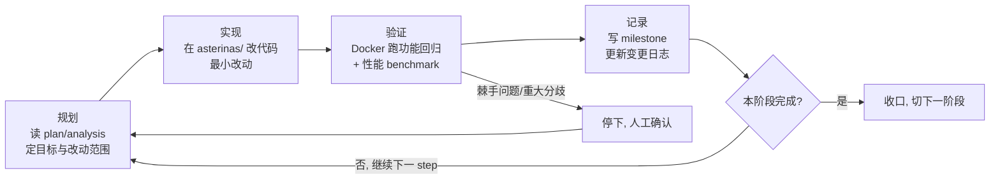

# AI 使用说明

> 赛题：2026 全国大学生计算机系统能力大赛 · 操作系统设计赛 · OS 功能挑战赛道
> 项目：在 Asterinas（Rust framekernel）上用 Rust 实现兼容 POSIX、支持 Extent 与 JBD2 完整日志的 EXT4 文件系统，并探索面向 RustOS 架构的性能优化技术。
> 代码基线：分支 `feature-sqlite-phase-6`。
> 文档日期：2026-06-22。

本文件按赛事要求，集中披露项目开发中 AI 工具的使用情况，包括工具与模型名称、使用场景、人机分工，以及与 AI 的交互记录和可追溯证据。本文件聚焦“如何使用 AI”，AI 产出的具体成果（代码、功能、性能）在项目主文档中说明。过程文档、源码与本文件互为印证。

---

## 1. 概述与披露范围

本项目的开发使用了 **DeepSeek V4 Pro 大模型 + Claude Code 命令行交互与执行 harness** 的协作方式。除此之外没有使用其他 AI 工具链。

需要先界定披露的范围。项目以开源的 Asterinas 内核为上游基线，上游本身由 Asterinas 社区维护，不在本次披露之列。**本团队在上游之上新增的全部 EXT4 文件系统相关工作**（核心库 `kernel/libs/ext4_rs/`、内核集成层 `kernel/src/fs/ext4/`、配套测试与全部过程文档），是在 DeepSeek V4 Pro 大模型辅助、并通过 Claude Code 的命令行交互与执行 harness 完成的，也是本文件披露的对象。

协作方式可以一句话概括：人类负责目标设定、技术路线裁决、诚实口径把关和最终验收，AI 负责在既定目标下做代码实现、问题诊断、性能分析和文档撰写。每个阶段都有人工确认的节点，下文第 3 节会展开。

---

## 2. AI 工具与模型清单

| 项 | 内容 |
|---|---|
| 交互与执行工具 | Claude Code（命令行交互与执行 harness） |
| 模型厂商 | DeepSeek |
| 使用的大模型 | DeepSeek V4 Pro |
| 协作方式 | 人类通过 Claude Code 与 DeepSeek V4 Pro 交互，AI 辅助完成实现、诊断、测试与文档工作 |
| 使用周期 | 2026-03 至今，覆盖 ext4 基础集成到当前 official xfstests 修复的全过程 |
| 运行方式 | 本地终端交互，人类下达任务并审阅每一步产出，再由人工提交代码 |

使用场景如下：

- **代码实现**：ext4_rs 接入 Asterinas VFS、JBD2 日志子系统、并发锁改造、PageCache 与 mmap 集成、O_DIRECT 读写路径。
- **问题诊断与调试**：崩溃恢复 bug、内存分配错误、并发数据一致性问题的定位与修复。
- **性能分析与优化**：延迟分层 profiling、瓶颈归因、优化策略设计与验证。
- **测试**：xfstests 套件集成、自研并发与崩溃恢复测试用例、回归守底矩阵的搭建。
- **文档撰写**：各阶段的计划、分析、进度（plan / analysis / milestone）文档，benchmark 复现指引，竞赛交付文档，以及本说明文件。

---

## 3. 使用场景与人机分工

### 3.1 固定的协作流程

项目把人机协作流程固化在仓库根目录的 `AGENTS.md` 中，作为每个阶段对 AI 的统一工作约定。每个阶段都按同一个闭环推进：

这个闭环里有两点决定了它不是 AI 的无人值守自动运行：

1. **遇到棘手问题或重大技术分歧时，AI 必须停下来等人工确认**（`AGENTS.md` 明确规定）。例如锁结构改造、崩溃一致性协议这类影响面大的设计，由人类拍板后才落地。
2. **每个阶段的验证结果由人类审阅**，功能回归是否真的不退化、性能数据是否可信，以人工验收为准，不以 AI 自述为准。

### 3.2 人类主导的决策

下面几类决定由人类做出，AI 执行或提供素材：

- **技术路线选择**。优化方向、是否拆锁、走 delalloc 还是 fsync safepoint 等关键岔路口由人类裁决；一般性分歧则按赛题要求处理即可。
- **阶段审查**。每个阶段开工前，人类审查 AI 提出的计划是否合理、是否对准目标；收尾时核对 milestone 记录是否与实测结果一致，不符处要求订正后才算收口。
- **测试参数**。功能与性能测试的关键参数（如 fio 的块大小、numjobs、`direct`，KVM / vhost 开关，lmbench 与 SQLite 用例的选择）由人类提供并确认，AI 负责执行测试与汇总数据。
- **诚实口径的把关**。性能结论一律采用 cache-off（关闭自研投机数据缓存）加 drop-caches 公平基线的口径。早期一版打开自研缓存的测法数字更漂亮，但不能真实反映文件系统能力，被明确弃用，不进任何对外结论。这条诚实底线由人类设定并贯穿始终。
- **范围控制**。每个阶段只做一个明确目标，不顺手扩大改动，避免破坏既有功能测试。
- **已知边界的如实声明**。revoke 写盘缺口、hardlink/symlink 未实现、official xfstests 全量收口中等，都按实际状态披露，不掩盖。

### 3.3 AI 主导的执行

在上述约束下，AI 承担了大部分动手工作：阅读参考实现（ext2 等）、写出具体代码、复现并定位 bug、设计 profiling 与测试、分析数据并起草文档。本文件第 4 节的过程文档清单，绝大部分是 AI 起草、人类审阅后定稿的。

---

## 4. 交互记录与可追溯性

与 AI 的交互记录以阶段过程文档的形式留痕。每个开发阶段对应一组过程文档（计划、分析、进度），按开发阶段组织，它们是交互过程的直接载体。

下表中文档均收录于本文件夹（`docs/AI_usage/`），链接为相对路径，可直接打开。

| 阶段 | 分支 | 主要交互文档 | 大致工作 |
|---|---|---|---|
| ext4 基础集成 | `stage1-ext4` 到 `stage-8` | [需求](asterinas_ext4_phase1_rs_requirements.md)、[集成报告](asterinas_ext4_phase1_rs_integration_report.md)、[诊断分析](analysis_phase1.md)、[优化计划](optimize_plan_phase1.md)、[进度](optimize_phase1_milestone.md) | ext4_rs 接入 Asterinas、单文件读写、Extent、初步性能优化 |
| JBD2 日志 | `jbd-phase-1` | [分析](feature_jbd2_phase1_analysis.md)、[计划](feature_jbd2_phase1_plan.md)、[进度](feature_jbd2_phase1_milestone.md) | 事务管理、日志刷盘、全量崩溃恢复 |
| 并发正确性 | `jbd-phase-2` | [分析](feature_jbd2_phase2_analysis.md)、[计划](feature_jbd2_phase2_plan.md)、[锁顺序](feature_jbd2_phase2_lock_order.md)、[进度](feature_jbd2_phase2_milestone.md) | 多文件并发、全局锁拆解、xfstests |
| 持久化语义 | `jbd-phase-3` | [预研](feature_jbd2_phase3_pretest.md)、[计划](feature_jbd2_phase3_plan.md)、[进度](feature_jbd2_phase3_milestone.md) | fsync/fdatasync/flush 与 Linux 语义对齐 |
| PageCache | `jbd-phase-4-pagecache` | [计划](feature_pagecache_phase4_plan.md)、[进度](feature_pagecache_phase4_milestone.md) | buffered I/O 与 mmap 接入 Asterinas PageCache |
| 性能优化 | `jbd-phase-5-optimize` | [计划](feature_perf_phase5_plan.md)、[进度](feature_perf_phase5_milestone.md) | 延迟归因、小块读与写优化 |
| SQLite 真实应用 | `feature-sqlite-phase-6` | [计划](feature_sqlite_phase6_plan.md)、[进度](feature_sqlite_phase6_milestone.md) | SQLite 写优化、并发反超 |
| official 修复 | `feature-fixerror-phase-7` | [计划](feature_fixerror_phase7_plan.md)、[进度](feature_fixerror_phase7_milestone.md) | official xfstests 错误修复（进行中） |

每份文档记录了对应阶段与 AI 协作时定的目标、遇到的问题、做出的取舍和最终结果，可与对应阶段的代码改动相互印证。

---

## 5. 诚信声明

本文件所述 AI 工具与模型名称、使用场景、人机分工与交互记录，均与项目实际情况一致。过程文档与源码可供核对，未作夸大或隐瞒。AI 的具体工作成果（代码规模、功能与性能数据）在项目主文档中说明。
