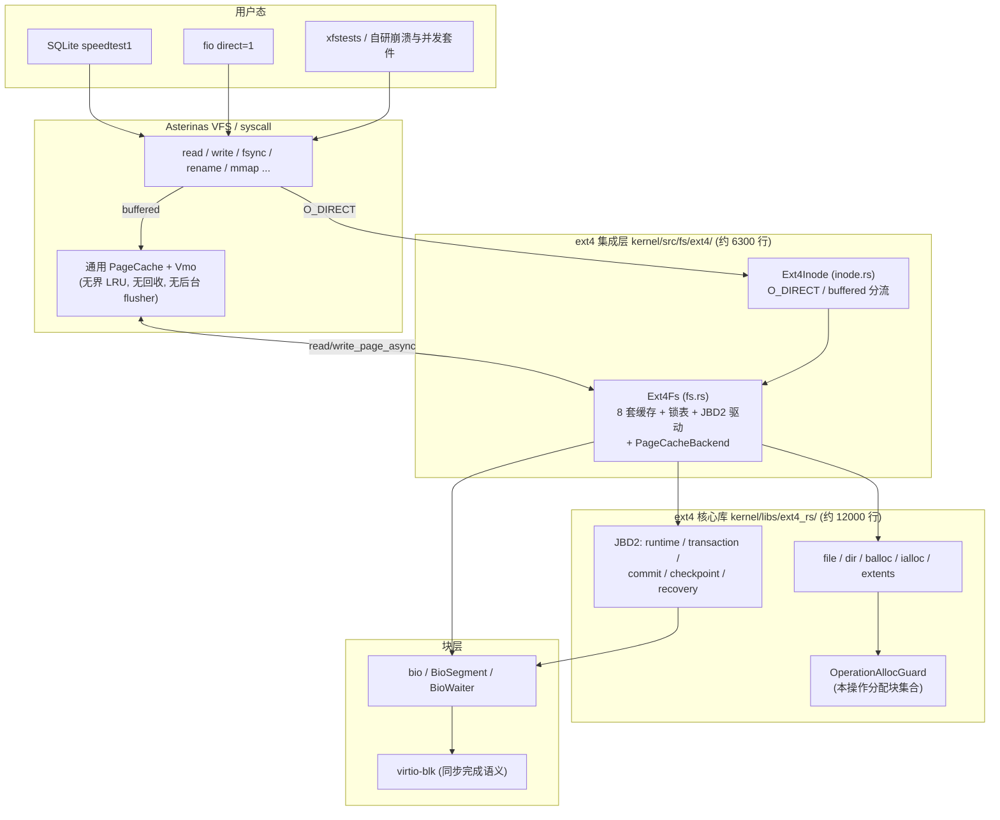
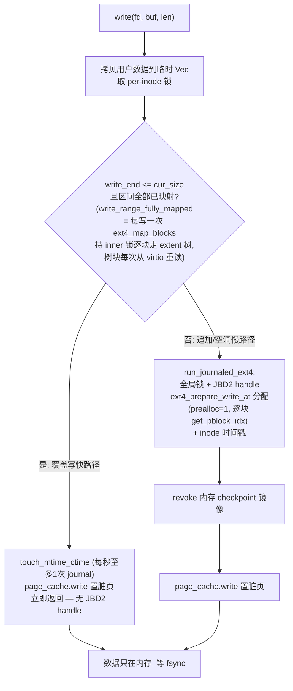
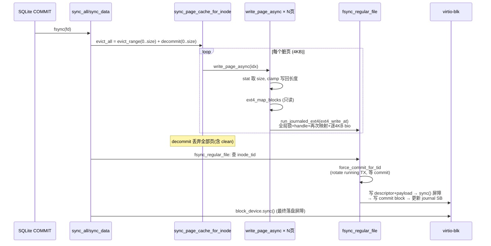
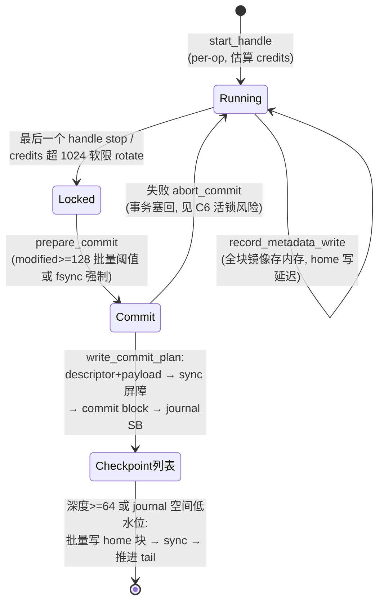
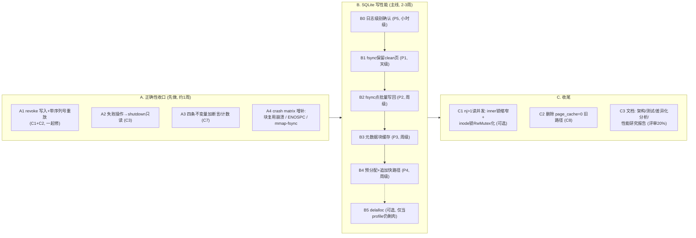

# ext4-on-Asterinas 技术分析报告：系统现状、问题清单与达标路线

> 项目：在 Rust framekernel 操作系统 Asterinas（OSTD 非特权运行环境，兼容 Linux ABI）上实现兼容 POSIX、支持 Extent 与 JBD2 完整日志的 ext4 文件系统。
> 本报告基于 2026-06 对 `asterinas/kernel/src/fs/ext4/`（集成层）与 `asterinas/kernel/libs/ext4_rs/`（核心库）的全量代码审查，所有结论附代码位置。
> 口径声明：本报告所有性能数字均为**诚实口径**（cache-off、drop-caches 公平基线、`direct=1 nj=1` 中位数）。历史 `read 127% / write 39%` 为 speculative data cache 开启时的数据，已废弃，不得用于答辩。

---

## 0. 摘要（TL;DR）

**现状**：功能侧已达优秀档要求——JBD2 完整日志（刷盘/事务/全量恢复）、Extent、全量 POSIX 接口、多文件并发读写、PageCache 集成、崩溃恢复矩阵全绿。性能侧 fio O_DIRECT 守底 75–123%，但 SQLite 真实应用写只有 Linux 的 **2.97%**（2022s vs 60s）。

**三个最重要的发现**（详见 §5）：

1. **正确性硬伤：JBD2 revoke 记录从未写入 journal**。崩溃重放可能把陈旧元数据镜像写回已被复用为数据的块，**静默损坏用户数据**。现有 crash matrix 未覆盖该场景，全绿≠没洞。这是唯一"答辩被问到就翻车"级别的问题，必须修。
2. **性能结构性根源：fsync 链全量丢页缓存 + 逐 4KB 同步回填 + 逐页 journaled 写回**。这是 SQLite 慢 33× 的主因，且**全部修复点都在 fsync 安全点上**，不触碰持久化语义、不依赖平台新基建。
3. **方向修正：delalloc 不应是 Phase 6 主线**。其收益的大半可由"保留 clean 页 + fsync 点批量写回 + 物理预分配"以远低的风险拿到；而 delalloc 的前置条件（乱序写回正确性）恰是当前已知损坏的部分。

**达标差距**：fio 小块（4K/16K read 86/84%、write 76/76%）距 90% 优秀档线还有缺口，但 ext2 在同平台同样止步 82–85%，证据指向 virtio 平台地板，需与评审口径对齐；SQLite 没有明确达标线，但 2.97% 在"真实工作环境性能表现"评审项上没有说服力，按 §6 路线预期可提升至 15–30%。

> **【2026-06-11 增编】本报告 §6 路线已执行完毕：SQLite 实测 234.9s = Linux 的 21.92%（正中 §6.2 预测的 15–30% 区间，7.4×），守底全绿。执行结果、结构变更、问题清单状态更新与新发现问题见 §7；上限的理论依据与 delalloc 解锁链见 §7.5。**

---

## 1. 赛题目标对照

评审四大项（权重）与现状：

| 评审项 | 优秀档要求 | 现状 | 差距/风险 |
|---|---|---|---|
| 实现完整度 40% | JBD2 完整功能（刷盘/事务/全量恢复）、多文件并发无错乱丢失、xfstests 核心 ≥95% | ✅ jbd_phase1 100%、crash 9/9 + 18/18、并发 7/7 + xfstests concurrency 10/10、phase3 fsync Tier1 11P/1N/0F、phase4 9P/0F/4N | ⚠️ revoke 缺失是"全量崩溃恢复"语义上的未覆盖洞（§5 C1） |
| 文档完整性 20% | 架构/用户/测试文档 + 差异化分析 + 性能研究报告（量化数据+学术结论） | 各 phase plan/milestone/analysis 文档齐备；学术型研究报告**未起草**（按当前决策延后） | 占 20% 分值，收尾阶段必须补 |
| Demo 质量 20% | 稳定运行、性能 ≥ Linux 90%、优化技术 ≥5% 提升、并发无数据问题 | fio read 86–123% / write 76–121%（5 档 bs 中 4 档未到 90%）；优化提升远超 5%（小块 ×2.6–5.2）；SQLite 端到端跑通 | ⚠️ 90% 线：小块缺口归因 virtio 平台层（ext2 同上限 82–85%），需答辩口径；SQLite 2.97% 是体验短板 |
| 创新性 20% | 1–2 种面向 RustOS 架构的优化技术，可复用、数据可信 | extent 映射计划缓存、inode 元数据缓存、覆盖写快路径、延迟归因 profiling 方法论 | 素材充足，需文档化提炼 |

---

## 2. 系统架构总览

### 2.1 分层结构



### 2.2 锁全景

| 锁 | 位置 | 保护对象 | 备注 |
|---|---|---|---|
| `EXT4_RS_RUNTIME_LOCK`（全局 Mutex） | fs.rs:92 | 全部 journaled 变更操作（create/write/truncate/dir ops） | 单线程 profile 显示持有≈47% wall；**只在 `run_journaled_ext4` 内持有，只读路径不持有** |
| `inner: Mutex<Ext4>` | fs.rs:1170, lock_inner fs.rs:1515 | Ext4 实例（per-op clone 的源） | **只读路径（`run_ext4_file_read_only`）持此锁横跨整个设备 I/O**——nj>1 读并发退化的第一序列化点其实是它，不是 RUNTIME_LOCK |
| per-inode correctness 锁（独占 Mutex 表） | fs.rs:1180 | 单文件读写/fsync/truncate 串行 | 同文件并发读也互斥；多 inode 按 ino 排序获取（fs.rs:1485） |
| per-dir correctness 锁 | fs.rs:1181 | 目录操作 | |
| `jbd2_runtime: RwMutex<Option<JournalRuntime>>` | fs.rs:1175 | 事务状态机、overlay 读 | |
| `jbd2_journal: Mutex` + `jbd2_checkpoint_lock` | fs.rs:1174/1179 | 日志盘上空间、checkpoint 串行 | |

锁序：inode/dir 锁 → RUNTIME_LOCK → inner → jbd2_runtime/jbd2_journal。审查未发现现存死锁路径，但有一条结构性脆弱点（§5 C7-d）。

### 2.3 缓存全景（8 套，各自独立失效）

| 缓存 | 内容 | 失效机制 | 问题 |
|---|---|---|---|
| `inode_meta_cache` + 生成数 | stat 元数据 | `run_journaled_ext4` 单点全清 + 生成数防 TOCTOU | 正确但全清粒度粗 |
| `inode_atime/ctime/mtime_ctime_cache` | 时间戳节流 | 各写路径手工维护 | 在 chokepoint 之外，易漏 |
| `dir_entry_cache` | 目录项 + 字节偏移 | dir 操作手工维护 | 无界 |
| `inode_extent_map_cache` | 逻辑→物理映射 | 写路径失效 | **page_cache=1 时整体旁路**（fs.rs:4643），buffered 路径完全未用 |
| `inode_direct_read_cache` | 退役的投机数据读缓存 | — | 守底口径默认关 |
| `inode_page_caches` | per-inode PageCache 状态 | fsync 全量 decommit | §5 P1 |
| `open_file_handles` / `inode_tids` | 打开计数 / fsync 目标 TID | 不回收 / 不回收 | 无界（小对象，低危） |

---

## 3. 关键数据路径流程

### 3.1 Buffered 写（`write_at_page_cache`，fs.rs:4786）



要点：
- **任何追加都走慢路径**（快路径要求 `write_end <= cur_size`）——SQLite 的 INSERT 新块 / CREATE INDEX / VACUUM 全部命中"每 4KB 一次完整 journaled 分配"。
- 慢路径先更新 inode size（journal 内），再把数据放进页缓存。**"size 先于脏页"是后续写回正确性的隐式不变量**（§5 C4）。
- 部分页写入会触发 Vmo `commit_page` → `read_page_async` 回填（读-改-写）；整页对齐写走 `commit_overwrite` 免回填（vmo/mod.rs:152-163）。

### 3.2 fsync 持久化链（inode.rs:513 → fs.rs）



要点：
- commit 块前**有** `block_device.sync()` 屏障（ext4_rs `jbd2/mod.rs:191-193`），fsync 尾部有最终 flush——**fsync 屏障纪律是对的**。
- 但 `evict_all` 在写回之后把**全部页（含 clean）decommit 掉**（fs.rs:1078-1081）→ 每个 COMMIT 后整个文件缓存归零（§5 P1）。
- 每个脏页一个独立 JBD2 handle + 全局锁 + 逐 4KB bio（fs.rs:1141-1157 → 4917-4955）（§5 P2）。
- 每次 fsync 与每次 commit 各打一条 `warn!` 日志（fs.rs:5510、fs.rs:2199）（§5 P5）。

### 3.3 O_DIRECT 路径与缓存一致性协议

```
O_DIRECT 写 (fs.rs:5035):
  inode 锁 → evict_page_cache_range(写回重叠脏页)        ← Linux write-and-wait 等价
          → 已映射: 复用映射缓存 / 未映射: journaled prepare
          → revoke 内存镜像 → 大 bio 提交
          → 成功后 discard_page_cache_range(失效重叠页)   ← Linux invalidate 等价
O_DIRECT 读 (fs.rs:4609):
  inode 锁 → evict_page_cache_range(先把脏页刷下去) → 计划映射 → bio → 拷出
```

结论：dio 与 buffered 的一致性协议**与 Linux 同构，做对了**；残余小洞（dio 与并发 mmap 写无防护）Linux 同样存在，可作为已知边界声明。

### 3.4 JBD2 事务生命周期



设计特征（与标准 JBD2 的差异详见 §5 C1/C2/C3）：
- 元数据以**全块镜像**形式留在内存事务里；active handle 存在期间 home 块写被延迟，读路径通过 overlay（`overlay_metadata_read`）叠加最新镜像。
- 数据块不入 journal（ordered 模式），由写路径直写 home 位置——天然满足"数据先于 commit record"。
- 恢复（recovery.rs）：扫描已提交事务 → 读 revoke 块（**但从来没人写过 revoke 块**）→ 逐块重放镜像 → 重置 journal。

### 3.5 truncate / unlink

```
truncate (fs.rs:5196): inode 锁 → 先全量写回页缓存 → journaled ext4_truncate
                       → discard_all + resize  (先写回再丢弃, 顺序正确但代价是全文件 evict)
unlink → cleanup_unlinked (fs.rs:4437): nlink==0 且无打开句柄时 discard 页缓存 + journaled truncate(0)
```

---

## 4. 性能现状与瓶颈归因

### 4.1 fio O_DIRECT 守底（诚实口径，相对 Linux ext4）

| bs | read | write | 备注 |
|---|---:|---:|---|
| 4K | 86.4% | 75.5% | 优化前 read 16–24% / write 20% |
| 16K | 84.4% | 75.8% | |
| 64K | 86.9% | 84.1% | |
| 256K | 94.8% | 121.1% | |
| 1M | 122.9% | 88.3% | |

ext4 域内 per-op 固定开销已榨干（extent 映射计划缓存、inode 元数据缓存、relatime、覆盖写快路径四项落地）；小块剩余缺口与 ext2 在同平台的 82–85% 上限一致，归因 Asterinas virtio 设备往返（平台层、跨 FS 通用）。

### 4.2 SQLite speedtest1：2.97% 的结构性解释

同口径三 FS 对照：本 ext4 = 3%，Asterinas 原生 ext2（无日志）= 95%，ramfs = 96% → 损失全部在本 ext4 写路径。每写时间归因：①每写映射检查 ≈41%，②慢路径逐页 journaled 分配 ≈32%，③每 COMMIT fsync + 逐 4KB bio ≈24%。

一个 SQLite 事务（COMMIT）在当前实现里的完整代价：

```
┌─ SQLite 一个写事务 ──────────────────────────────────────────────────┐
│ 1. 写 journal 文件(新建+追加, 非4K对齐)                                │
│    → 每 4KB: 慢路径 journaled 分配(全局锁+handle+逐块树下沉+bitmap)    │
│    → 非对齐部分页: read_page_async 逐块同步回填 (RMW)                  │
│ 2. 改 DB 页(覆盖写)                                                   │
│    → 每写一次 write_range_fully_mapped: 持 inner 锁逐块走 extent 树,   │
│      树块每次从 virtio 重读 (≈41%)          ← 上一轮 fsync 把缓存清了  │
│    → 部分页 RMW 回填: 又是逐 4KB 同步读      ← 同上                    │
│ 3. fsync journal 文件 + fsync DB 文件                                  │
│    → 逐脏页: 1 个 JBD2 handle + 全局锁 + 1 个 4KB bio  (≈32%+24%)      │
│    → journal commit: sync 屏障 + commit block                          │
│    → evict_all decommit: 把整个文件缓存丢光  ← 回到第 2 步的恶性循环    │
│    → 2 条 warn! 串口日志                                               │
│ 4. unlink journal 文件 (journaled 目录操作 ×2)                         │
└──────────────────────────────────────────────────────────────────────┘
ext2 同负载: 第2步纯内存命中(fsync后留clean页), 第3步逐页直写无journal,
             第1步扩容即分配无日志 → 95%
```

**结论：33× 差距不是"日志的必然代价"，而是"每个 COMMIT 把缓存清零 + 逐 4KB 同步 I/O + 逐页 journal handle"三个实现选择的乘积。** 三者都可以在保留完整 JBD2 语义的前提下消除（§6）。

---

## 5. 问题清单

按严重性排序。C = 正确性，P = 性能。每条给出：根因、代码位置、验证方法、修复建议。

### C1【严重·必修】revoke 记录从未写入 journal —— 崩溃重放可静默损坏数据

- **现象/根因**：恢复路径会读取 revoke 块（`ext4_rs/jbd2/recovery.rs:48`），但 commit 路径 `write_commit_plan`（`jbd2/mod.rs:144-217`）只写 descriptor/payload/commit 三种块；`RevokeBlockHeader::new`（`ext4_defs/jbd2.rs:392`）全仓库**零调用**。写路径的 `revoke_jbd2_checkpoint_metadata_blocks`（fs.rs:3549）只是该问题的"内存半边"补丁，且只清 `checkpoint_list`（`jbd2/journal.rs:137-149`），不清 running/prev_running/committing 三个阶段。
- **损坏场景**：元数据块 B（目录块/extent 树块）的镜像在已提交事务 T 中 → B 被释放并重新分配为**数据块**（数据直写 home）→ tail 越过 T 之前崩溃 → replay 把 T 中 B 的陈旧元数据镜像写回 → 用户数据被静默覆盖。SQLite delete 模式每事务建/删 journal 文件，块 free→realloc 流转极频繁，暴露面大。
- **为什么测试全绿**：crash matrix 没有构造"元数据块释放后被数据复用 + checkpoint 前崩溃"场景。
- **验证**：建大目录（撑出目录块/树块）→ 删目录 → 建大文件复用同批块 → fsync → 用 `replay_hold` 在 checkpoint 前杀 VM → remount → 比对文件 CRC。
- **修复**：释放元数据块的操作（truncate/rmdir/extent 收缩）向当前事务记 revoke 集合；commit 时在 descriptor 前写 `JBD2_REVOKE_BLOCK`（replay 已会读）；同时把内存 revoke 扩到全部四个事务阶段。**必须与 C2 一起修**。

### C2【严重·与 C1 联动】recovery 的 revoke 没有序列号上界

- **根因**：`recovery.rs:48-54` 把全程扫到的 revoke 块号对**所有**事务生效（包括比 revoke 记录更新的事务）。标准 JBD2 语义：只跳过 `sequence <= revoke 所在 sequence` 的事务镜像。
- **后果**：当前没人写 revoke 所以是潜伏问题；**若修 C1 时朴素地写 revoke 而不带序列号判断，会把"块后来又重新成为元数据并再次 journal"的合法新镜像也跳过**——修一个洞开一个洞。
- **修复**：revoke 集合从 `BTreeSet<u64>` 改为 `BTreeMap<u64, u32>`（块号→最大 revoke 序列号），重放时按序列号过滤。

### C3【严重】失败操作的半成品元数据会被提交，且无 journal abort 升级路径

- **根因**：`finish_jbd2_handle(succeeded=false)`（fs.rs:4067）只 stop handle；失败前已 `record_metadata_write` 的块镜像**留在事务中照常 commit + checkpoint**。`alloc_guard`（`ext4_impls/alloc_guard.rs`）只是分配去重集合，**没有失败回滚**。一次 ENOSPC 打断在"bitmap 已改、extent 未插"的中间点，盘上即是不一致元数据。Linux jbd2 的对应机制是 handle abort → journal abort → 文件系统转只读。
- **验证**：把盘填满跑追加写（触发分配中途 ENOSPC），之后 e2fsck。
- **修复（保守版，工作量小）**：journaled 闭包返回 Err 时设置 `shutdown_state`（机制已存在，fs.rs:1200），文件系统转 EIO 只读，避免不一致元数据继续扩散；完整版（操作内 undo）赛后做。

### C4【高·已造成事故】`write_page_async` 的 size-clamp 静默丢数据 —— "途中写回损坏"的第一嫌疑

- **根因**：fs.rs:1141-1157：`offset >= file_size` 直接返回空（页被标 clean 但一个字节没写）；跨 size 的页只写 `file_size - offset` 截断部分。整条写回正确性依赖**无断言保护的隐式不变量**："脏页内容永远不超过当前 on-disk inode size"。
  - 基线在 fsync 点成立（慢路径先 prepare 更新 size 再置脏页）。
  - **delalloc 实验删掉 prepare → size 不再先行 → 不变量崩 → malformed**，这几乎直接解释了 Phase 6 前期 delalloc 实验的数据损坏。
  - SQLite journal 文件是非 4K 对齐追加（512B 头），最容易踩 clamp 边界。
- **第二嫌疑**（同时解释"基线路径途中写回也损坏"）：C1 的内存版——途中写回使 commit/checkpoint 与分配高频交错，"持有陈旧镜像但尚未进 checkpoint_list 的事务"随后入列，checkpoint 把陈旧镜像写回已复用为数据的块。
- **最快定位法**：
  1. shadow-file 差分（用户态记录每次 write 的 offset/len/CRC，损坏后对比）：坏区是**零/缺尾**→clamp；**长得像元数据的外来内容**（`0xF30A` extent magic、目录项结构）→镜像覆盖；**旧版本数据**→丢脏页。
  2. 两个断言：`write_page_async` 凡 clamp/drop 即记日志；checkpoint 写 home 前断言块号不在"最近分配为数据的块"集合中。
- **修复**：将不变量显式化——writeback 长度以"页内有效数据长度"为准（或断言 size 覆盖脏页）；做 delalloc 前必须先把 size 语义与写回解耦。

### C5【中高】inode 内存字符串 path，`lookup("..")` 用陈旧 path 解析

- **根因**：`Ext4Inode` 存 `path: String`（inode.rs:39）；`lookup("..")` 通过 `dir_open(parent_path)` 解析（inode.rs:413-422）。祖先目录被 rename 后该 path 陈旧，而 `is_dentry_cacheable=false`（inode.rs:574）意味着 VFS 每次都落到这段代码——**疑似可复现的错误解析**。
- **验证**：open 子目录 fd → rename 其祖先 → `openat(fd, "..")` 比对 ino。
- **修复**：".." 解析改为读目录的真实 `..` 目录项（盘上有），inode 身份只用 ino；path 仅留调试用途。

### C6【中】`abort_commit` 活锁：单事务超过 journal 容量时 commit 永久失败循环

- **根因**：credits 是软限制（仅影响 rotation 启发，`JOURNAL_TRANSACTION_CREDIT_SOFT_LIMIT=1024` 不强制）；若单事务元数据块数 + 2 > journal 可用空间，`write_commit_plan` ENOSPC → `abort_commit` 把事务塞回 → 下次重试再失败（fs.rs:2131-2141）。128 块 rotation 使之罕见，但 journal 建小 + 大 truncate 可触发。
- **修复**：commit 失败次数超阈值 → shutdown 只读（与 C3 共用机制）；或 admission 时硬性拒绝超容量 handle。

### C7【中·系统性】关键正确性押在无断言的隐式不变量上

四条不变量，每条都"恰好成立或恰好没被测到"，而 Phase 6 要做的事每件都会碰其中至少一条：
- (a) "inode size 先于脏页更新"（C4）；
- (b) "virtio 同步写完成 = 有序持久化"（fs.rs:2145-2149 注释明示；guest-crash 成立、host 掉电不成立——答辩需主动声明口径，与 Phase 3 文档一致）；
- (c) "revoke 只需要管 checkpoint_list"（C1）；
- (d) "page cache backend 回调（`read/write_page_async` → `run_ext4_*`）永远不会在持 RUNTIME_LOCK 时被进入"——今天成立，**一旦有人把 `page_cache.write` 挪进 journaled 闭包（很自然的重构）就是自死锁**。
- **修复**：每条加 debug_assert 或统计计数 + 代码注释；这是低成本高回报的防回归投资。

### C8【低·建议直接删除】page_cache=0 旧 Vec 路径已知 corruption（A2）

旧路径（fs.rs:4698 起的 `write_at`/`read_at` Vec 实现）已知损坏且无人使用（守底走 O_DIRECT，应用走 page_cache=1）。留着只有维护成本和被误开的风险。**建议 Phase 6 直接删除该路径**，page_cache=1 设为唯一 buffered 路径。

### C9【低】无界内存结构清单

`inode_tids`（不回收）、`dir_entry_cache`（整目录树永驻）、`inode_correctness_locks`（每触过的 ino 一项）、`inode_page_caches`（close 不回收，fs.rs:4418-4428 只减计数）、JBD2 事务内存全块镜像（rotation 限单事务百级块、深度 64 封顶，总量可控）。比赛场景无害；**建议加一个总量统计接口**（所有 cache 字节数一键 dump）——delalloc OOM 根因至今未查实，缺的就是这个观测面。

### P1【性能·第一优先】fsync `evict_all` 全量 decommit —— SQLite 慢 33× 的最大单点

- **根因**：fs.rs:1078-1081，fsync 写回后把 0..file_size **全部页（含 clean）decommit**。每个 COMMIT 后整文件缓存归零 → 后续所有读、所有非整页写的 RMW 回填全部打到 `read_page_cache_data_at` 的**逐 4KB 同步读循环**（fs.rs:4998-5029，无合并 bio、无预读）。这就是连 in-place UPDATE 都比 ext2 慢 15–35× 的原因（ext2 fsync 留 clean 页）。
- **修复**：fsync 只 `evict_range`（写回+标 clean），**不 decommit**；decommit 留给 truncate/unlink/O_DIRECT 一致性点。这是 Linux 语义，完全诚实；内存上界 = clean 工作集，与 ext2 同构且已实证装得进 8GB。**改动量极小，预期收益最大。**

### P2【性能·第二优先】逐页 journaled 写回 + 逐 4KB bio

- **根因**：每个脏页一次 `run_journaled_ext4(ext4_write_at)`（全局锁 + handle + 重复映射 + 4KB bio）。**对已分配块的纯数据写回在 ordered 语义下根本不需要 JBD2 handle**（数据不是元数据；handle 里唯一变更是重复的 inode mtime）。
- **修复**（全部在 fsync 安全点，语义不变）：收集脏页区间 → 合并 → 每个连续区间一次轻量元数据处理（已映射时仅 inode 时间戳/size，一个 handle 搞定全部区间）→ 数据按物理连续段合成大 bio（复用 O_DIRECT 的 `submit_direct_write_mappings` 管道）→ 照旧 force-commit + flush。攻归因 ②32%+③24%。Phase 5 那次"批量化只拿 3%"的失败是只合并了 bio、没干掉逐页 handle，且当时 ① 还在大头位置掩盖收益；本次有占比表支撑，按铁律先挂 profile。

### P3【性能·第三优先】每写映射检查从设备重读 extent 树块（归因 ① ≈41%）

- **根因修正**：`write_range_fully_mapped`（fs.rs:4896-4915）走 `run_ext4_file_read_only`——**不持 `EXT4_RS_RUNTIME_LOCK`**，持 `inner` 锁横跨设备 I/O；成本大头是**每次写都从 virtio 重读 extent 树块**（Phase 5 的 inode meta cache 只修了 stat，没修树块）。"41% 是锁"的旧归因不准确，修法是缓存而不是拆锁。
- **失败教训复盘**：此前"前缀/窗口结果缓存"命中率 0.005% 是**粒度错误**（缓存查询结果，miss 后整文件重建）。正确粒度是**有界的元数据块缓存（buffer cache）**：按 pblock 缓存 extent 树块/inode 块本身（LRU 上限几 MB），失效复用 `run_journaled_ext4` chokepoint + 生成数机制。B 树散点写命中的是同一批树块（文件 extent 数百以内树仅 1–2 层）；碎片文件 miss 也只是单次树下沉，没有灾难回退模式。
- 另：现成的 `inode_extent_map_cache` 在 page_cache=1 时被整体旁路（fs.rs:4643 的 `&& !page_cache_enabled` 条件），buffered 写也完全没用它——现成资产闲置。

### P4【性能·第四优先】追加无快路径 + 物理预分配为 1

- **根因**：`WRITE_PREALLOC_BLOCKS = SMALL_WRITE_PREALLOC_BLOCKS = 1`（`ext4_rs/file.rs:14-15`）；`ensure_write_range_mapped` 对每块一次 `get_pblock_idx` 整树下沉（file.rs:913-981）。任何追加都进慢路径（§3.1）。
- **修复**：
  1. 检测顺序追加时按 64–256 块物理预分配（`balloc_alloc_block_batch` + `insert_allocated_blocks_as_extents` 管道现成，file.rs:1004-1037）。崩溃后多出 i_size 外的已分配块 = 空间泄漏（Linux 行为类似），读被 i_size 钳住不暴露脏数据，诚实。
  2. 给"已映射但越 EOF"的追加开轻 handle 快路径（只 journal inode size，不走分配）。
  - 攻 SQLite INSERT/CREATE INDEX/VACUUM 主场景。

### P5【性能·零成本】每 fsync / 每 commit 各一条 `warn!` 串口日志

fs.rs:5510（"Step 1 observation"遗留）与 fs.rs:2199。SQLite 每事务至少一次 fsync；若 benchmark 日志级别含 warn 且走串口，这是每事务一次串口 I/O。**先确认日志级别，开着就是白捡的。**

### P6【性能·平台交互】PageCache backend 假异步

`read/write_page_async` 同步做完返回空 BioWaiter（fs.rs:1126-1157），平台 readahead 状态机在 ext4 上退化为串行逐块同步读。P1/P2 落地后若 buffered 读仍是瓶颈（lmbench 口径），再做真异步/批量回填。

### 方向性结论：delalloc 降级为可选项

delalloc 三块预期收益中：大 bio、免逐页 journal → **P2 在 fsync 安全点直接拿到**；大 extent 分配 → **P4 物理预分配拿到大半**。其前置条件（乱序写回正确性）= C4 必须先修。**建议顺序：P5 → P1 → P2 → P3 → P4，每步之间重跑 profile 与守底；P4 之后若 profile 仍显示分配开销显著，再评估 delalloc。** 平台基建（页回收 shrinker、后台 flusher）Phase 6 不需要也不要做（OSTD 层周级工程，比赛投入产出比极差），列为赛后 hardening。

---

## 6. 达标路线图



### 6.1 顺序与理由

1. **A 组先行**：B 组每一步（尤其 B2/B4/B5）都会扩大 C1/C4 的暴露面；不先收口，性能优化等于在已知雷区上加速。A1 是唯一可能在答辩中被实质性挑战的崩溃一致性缺口。
2. **B 组严格按 B0→B4 顺序**，每步之间：重跑 buffered write profile（基建已就绪，`ext4fs.phase2_profile=1`）确认归因变化 + 完整守底门控（见 6.3）。这是 Phase 5"未 profile 先动手被回退"教训的制度化。
3. **C3 文档**按当前决策延后，但评审占 20%，B 组收口后必须立即启动；建议把本报告 §3/§4/§5 直接作为差异化分析与研究报告的素材骨架。

### 6.2 预期收益（诚实预估）

| 步骤 | 攻击面 | SQLite TOTAL 预期 |
|---|---|---|
| 起点 | — | 2022s（2.97%）|
| B0+B1 | 缓存清零恶性循环、RMW 回填、串口日志 | 预计降至 600–1000s 区间（UPDATE 类受益最大）|
| B2 | 归因 ②32%+③24% 的 handle/bio 部分 | 再降 30–50% |
| B3 | 归因 ① ≈41% | 再降 20–35% |
| B4 | INSERT/CREATE INDEX/VACUUM 分配 | 再降 15–30% |
| 合计 | — | **目标 200–400s（Linux 的 15–30%）**；virtio 平台地板 + 同步写语义决定不会逼近 Linux，答辩口径以"三 FS 对照 + 逐项归因消除"讲故事 |

fio 守底不动（O_DIRECT 路径与 B 组改动正交，B1 的页保留对 O_DIRECT 一致性协议无影响——dio 写本来就 evict+discard）。

### 6.3 守底门控（每步必过，任何回退即止损）

1. fio O_DIRECT 5 档 bs 读写不低于当前值（75–123%）；
2. 崩溃恢复矩阵（jbd_phase1 9/9、phase2 18/18、Phase 3 host-crash fsync 4/4）+ **A4 新增的块复用崩溃用例**；
3. SQLite `PRAGMA integrity_check` + speedtest1 端到端；
4. phase3/phase4/phase6/并发（自研 phase2_concurrency + xfstests concurrency 10/10）全绿；
5. Phase 4 buffered/direct coherency、mmap、dirty-PageCache-fsync 验证。

### 6.4 答辩口径备忘

- 性能宣传一律用诚实口径表（§4.1），主动说明历史 cache-on 数字已废弃；
- 崩溃一致性范围主动声明：guest-crash 全覆盖；host 掉电依赖 virtio 同步写序（与 Phase 3 文档一致）；
- 小块 fio 缺口用 ext2 同平台对照（82–85% 同上限）归因 virtio 平台层；
- 创新点素材：延迟归因驱动的四层 ns profiling 方法论、覆盖写快路径、inode/extent 元数据缓存 + 生成数失效协议、（B 组完成后）fsync 安全点批量写回。

---

## 附录 A：关键验证实验设计

| 实验 | 步骤 | 判定 |
|---|---|---|
| A-1 块复用崩溃（验证 C1） | 建 2 万文件目录 → 删整目录 → 建 1GB 文件 fsync → `replay_hold` 于 checkpoint 前杀 VM → remount | 文件 CRC 不变为 PASS；出现 `0xF30A`/目录项样式污染即复现 C1 |
| A-2 ENOSPC 半成品（验证 C3） | 填盘至 99% → 并发追加写至 ENOSPC → 正常 umount → e2fsck | fsck 零错误为 PASS |
| A-3 陈旧 path（验证 C5） | open 子目录 fd → rename 祖先 → `openat(fd,"..")` | 返回 ino 与新父一致为 PASS |
| A-4 损坏签名差分（钉死 C4） | shadow-file 记录每写 CRC + write_page_async clamp 日志 + checkpoint 数据块断言，重跑途中写回实验 | 三类签名（零尾/外来元数据/旧数据）分别指向三个根因 |
| A-5 mmap 脏页 | mmap 写 → 不 msync → fsync → 杀 VM → remount 比对 | 数据在为 PASS |
| B-x 每步性能验证 | `run_sqlite_summary.sh` 同口径 + buffered write profile 占比表 | 占比表确认本步攻击面确实缩小 |

## 7.【2026-06-11 增编】路线执行结果、结构变更与问题清单更新

> 本节为 §6 路线执行后的结果增编。原 §0–§6 保留为"诊断时点"（2026-06-10，2.97%）的分析记录；本节记录"治疗结果"。详细过程见 `feature_sqlite_phase6_milestone.md` 变更日志与 `feature_sqlite_phase6_plan.md` §P 系列。

### 7.1 性能最终结果（诚实口径，与 §4 同基准）

| 阶段（时间序）| 改动 | SQLite TOTAL | ratio |
|---|---|---:|---:|
| 诊断时点（本报告 §4.2）| — | 2010.7s | 2.97% |
| S3 fsync 保留 clean 页（= 本报告 P1 处方）| 删 `evict_all` 的 decommit，新增 `flush_all` | 1868.2s | −7% |
| S4 fsync 批量写回（= P2 处方）| `write_pages_async` 按连续脏页 run 合并 handle/bio | 1772.4s | −5% |
| S6 unwritten extent + 写时预分配（= P4 处方）| ext4_rs 实现 unwritten 语义；`SMALL_WRITE_PREALLOC_BLOCKS=1→32` | 1332.2s | 3.86% |
| **P1 设备块缓存**（= P3 处方的泛化）| adapter 层 `DeviceBlockCache` write-through 镜像，命中率 98.5% | **454.3s** | **11.26%** |
| **P2 写快路径 ext2 化** | `WrittenCoverage` 区间集 + VmReader 直写 + meta cache per-ino 失效 | **243.9s** | **20.88%** |
| P3b journal commit 合并写 | descriptor+payload 单 bio（中性保留）| 243.97s | — |
| P5a lean prepare | 全已分配写单遍探测（3 遍树查→1 遍）| **234.9s** | **21.92%** |

**对照 §6.2 预测（200–400s / 15–30%）：实测 234.9s / 21.92%，正中区间。** fio O_DIRECT 守底未回退（最近复跑 write 79–83% / read 98–110%）。全程 integrity PASS、crash matrix 18/18、xfstests 四包 + 并发两层 + host-crash 4/4 + fsync_flush 每步全绿。

负结果（同样是结论）：①delalloc 仍被 Stage 1a"途中写回损坏"挡死（§7.5）②P3-1 size-only append（写时不转换）三配置实测净负（462.9/312.8/468.0s），含未解的读侧 30% 回退，已回退留 patch ③P4 真 fdatasync 动手前被计数器证伪（fsync 桶实测仅 28.6s，commit 由批量轮转驱动而非 fsync 驱动）。

### 7.2 本轮结构变更（附录 B 的增量）

| 新结构 | 位置 | 说明 |
|---|---|---|
| `DeviceBlockCache`（P1）| `fs.rs` adapter 层 | 设备 home 内容的 write-through 镜像（32MB LRU），居 JBD2 overlay 之下→一致性局部化到 adapter；checkpoint/recovery 写天然穿透；唯一旁路 O_DIRECT 数据 bio 显式失效；`[ext4-blkcache]` 计数 |
| `WrittenCoverage`（P2）| `fs.rs` | per-inode 内存 allocated 区间集（**coverage ⊆ truth** 不变量：populate-on-miss 权威走树 + prepare 后有界尾段补全 + Truncate/unlink/rename 失效），快路径覆盖判定 = 单次 BTreeMap 前驱查询 |
| unwritten extent 语义（S6）| `ext4_rs` | 读路径返零 / `convert_unwritten_span` 写转换（左合并保树紧凑）/ map 区分；e2fsck/debugfs 互操作验证 |
| lean prepare（P5a）| `ext4_rs file.rs` | `prepare_write_at` 全已分配单遍探测捷径 |
| `write_blocks_coalesced`（P3b）| `ext4_rs jbd2/device.rs` | journal 块按逻辑+物理双连续合并大写 |
| `[ext4-fsync]` 三段计时 | `fs.rs` `sync_regular_file_blocking` | fsync 写回/commit 等待/flush 拆分（fsync/fdatasync 统一入口）|
| meta cache per-ino 失效（P2）| `fs.rs` chokepoint | Write/InodeMetadata/Truncate 单 ino remove；目录 op 保守 clear-all |
| 防御加固 | `ext4_rs extents.rs` | `ext_remove_leaf` 与 `insert_extent` 容量钳制：损坏节点降级 EIO 不再 panic（388/476 家族）|

### 7.3 问题清单状态更新（对照 §5）

- **C1/C2（revoke）**：**仍未修**，维持"必修保答辩"。S6 预分配 + P2 提速加大块复用节奏 → 暴露面扩大，优先级进一步上调。
- **C4（size-clamp）**：未改动；S4/P 系列均显式保留 clamp 语义，相关守底（coherency/mmap）全绿。
- **C8（A2 旧 Vec 路径）**：未动。
- **P1–P6（性能处方）**：P1→S3 落地（实测 −7%，远低于本报告"降至 600–1000s"的预估——**估计被实测修正**：大头实为每写元数据设备读，见 7.2 的 DeviceBlockCache）；P2→S4 落地；P3→由 DeviceBlockCache+WrittenCoverage 超额完成；P4→S6+P5a 落地；P5→实测证伪（honest 口径 `LOG_LEVEL=error` 下 warn 不格式化，零成本）；P6 未动（写侧 bio 已非瓶颈）。

### 7.4 新发现问题（本轮新增）

| 编号 | 问题 | 状态 |
|---|---|---|
| N1 | **S6 尾段部分插入失败双重释放**（generic/388 内核 panic：已插入 extent 引用的块被整体释放→重分配覆写→树叶变垃圾）| ✅ 已修（只释放未插入后缀）+ 防御钳制；fsync_flush ×2 验证 |
| N2 | **388/476"压力垃圾节点"家族共同根因未钉死**（fsstress 满盘 ENOSPC 与 extent 操作部分失败的窗口）| ⚠️ 防御已保证降级 EIO 不 panic（4 轮 concurrency 判定 476 为低频潜伏）；根因追踪列为 hardening 项 |
| N3 | **P3-1 读侧 30% 回退之谜**（推迟转换半步即触发，三轮未钉死）| ⚠️ 未解；是重启延迟转换/delalloc 路线的前置（需先加写回转换计时/populate/find_extent 计数）|
| N4 | crash harness 端口碰撞 flake（osdk 按秒选随机端口，场景间背靠背启动相撞）| ✅ 已修（场景间 sleep 2，当日 5 次→0）|

### 7.5 上限的理论依据与 delalloc 解锁链（答辩核心论证）

1. **不是根本极限**：Linux ext4 带完整 JBD2 = 51s。贵的不是日志，是付税方式——delalloc 把每页元数据成本摊到每 extent（≈0），我们"写时同步转换"每 4KB 全额支付。
2. **类别内数学下限**：549K 次新分配写 ×（零填 ~30us + handle/overlay ~60–100us + 转换 ~30–50us），理想化到 100us/次也有 ≈55s——仅此一项逼近 90% 目标总预算（57s）。类别内理论最优 ≈110–120s（43–46%，无已知路径）；**现实可达 ≈190–210s（24–27%）**（剩 P5b 脏页索引 ~12–15s）。曲线实测趋平：P1 −66% → P2 −46% → P5a −4%。
3. **delalloc 解锁链（50–90% 唯一通道，估 2–4 周，赛期外）**：① 钉死 Stage 1a"途中写回损坏"exact-line 根因（未钉死，可能是可修 bug 而非铁墙）→ ② 安全写回驱动（修①或建后台 flusher，OSTD 级）→ ③ 解开 N3 → ④ delalloc 本体 + 全量崩溃语义门控。
4. **答辩口径**（更新 §6.4）："2.97% → 21.92%（7.4×）+ 三 FS 三角归因（ext2 94.91% 证平台地板薄）+ 守底全绿 + 类别下限数学 + 负结果方法论（三次先核实省实现）"。

## 附录 B：本报告引用的关键代码位置索引

| 主题 | 位置 |
|---|---|
| buffered 写快/慢路径 | `kernel/src/fs/ext4/fs.rs:4786-4915` |
| fsync 链 | `kernel/src/fs/ext4/inode.rs:513-548`、`fs.rs:1400-1429`、`fs.rs:5492-5536` |
| evict_all/decommit | `fs.rs:1078-1105` |
| 逐页写回 backend | `fs.rs:1126-1167`、`fs.rs:4917-4955` |
| 逐块同步回填 | `fs.rs:4957-5033` |
| O_DIRECT 一致性 | `fs.rs:5035-5194`（写）、`fs.rs:4609-4696`（读）|
| run_journaled_ext4 | `fs.rs:4019-4107` |
| JBD2 commit/屏障 | `fs.rs:2096-2237`、`ext4_rs/jbd2/mod.rs:144-217` |
| JBD2 runtime 状态机 | `ext4_rs/jbd2/journal.rs` |
| recovery/revoke | `ext4_rs/jbd2/recovery.rs:32-77, 176-230` |
| 内存 revoke（仅 checkpoint_list） | `ext4_rs/jbd2/journal.rs:137-149`、`fs.rs:3549-3567` |
| alloc_guard（无回滚） | `ext4_rs/ext4_impls/alloc_guard.rs` |
| 分配/预分配常量 | `ext4_rs/ext4_impls/file.rs:14-15, 855-1060` |
| 锁定义 | `fs.rs:92, 1170-1181, 1515` |
| 每 fsync/commit warn 日志 | `fs.rs:5510, 2199` |
